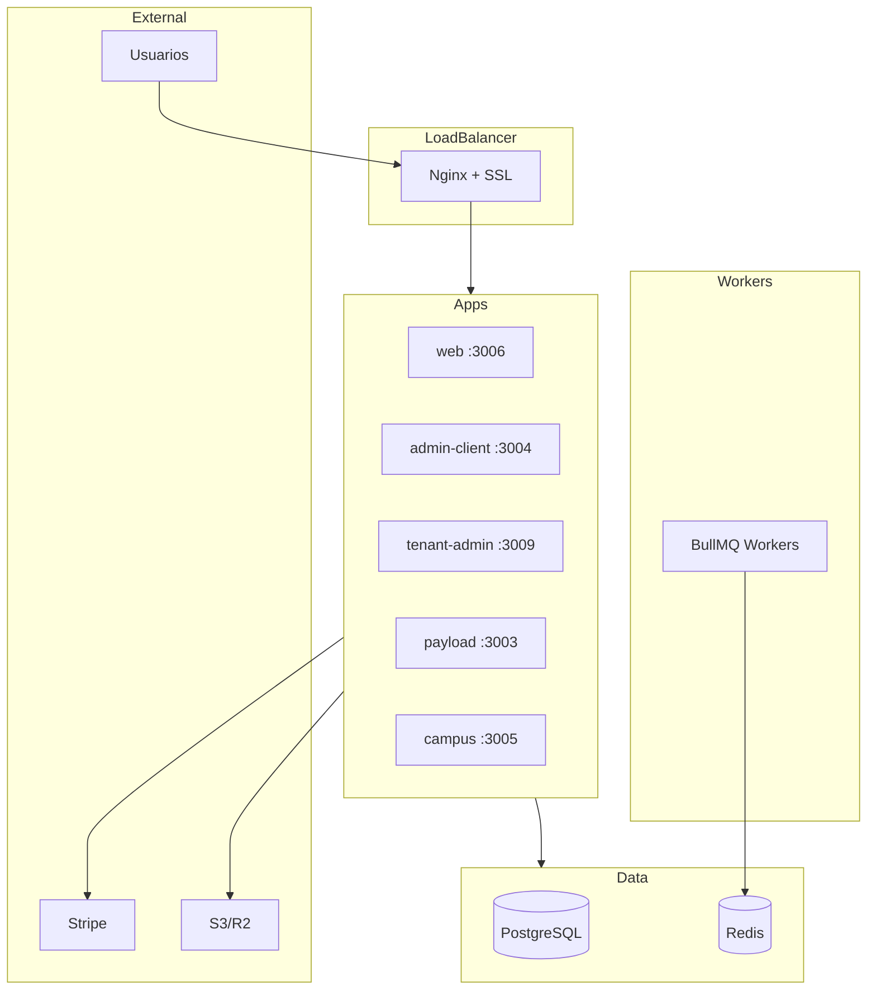

# Informe de Auditoría - Akademate.com
**Fecha:** 2026-01-27
**Versión:** 1.0
**Autor:** Auditoría Automatizada

---

## 1. Estado Actual del Sistema

### 1.1 Resumen Ejecutivo

| Aspecto | Estado | Puntuación |
|---------|--------|------------|
| **Arquitectura** | Sólida | 8/10 |
| **Calidad de Código** | Buena | 7/10 |
| **Tests** | Buena cobertura | 8/10 |
| **Seguridad** | Adecuada con mejoras pendientes | 7/10 |
| **Infraestructura** | Funcional, necesita separación | 6/10 |
| **Documentación** | Buena | 8/10 |

### 1.2 Stack Tecnológico

| Componente | Tecnología | Versión | Estado |
|------------|------------|---------|--------|
| Runtime | Node.js | 22+ | Actual |
| Package Manager | pnpm | 9.15.4 | Actual |
| Framework | Next.js | 15.5.9 | Actual |
| React | React | 19 | Actual |
| CMS | Payload CMS | 3.67.0 | Actual |
| Base de datos | PostgreSQL | 16 | Actual |
| ORM | Drizzle | 0.45.0 | Actual |
| Cache/Queue | Redis + BullMQ | 7 / 5.30.3 | Actual |
| TypeScript | TypeScript | 5.9.3 | Actual |

---

## 2. Inventario Técnico

### 2.1 Estructura del Monorepo

```
akademate.com/
├── apps/                    # 7 aplicaciones
│   ├── web/                 # Portal público (:3006)
│   ├── admin-client/        # Dashboard SuperAdmin (:3004)
│   ├── tenant-admin/        # Dashboard Cliente (:3009)
│   ├── payload/             # CMS headless (:3003)
│   ├── campus/              # LMS alumno (:3005)
│   ├── portal/              # Portal desarrollo (:3008)
│   └── ops/                 # Operaciones internas
├── packages/                # 16 packages compartidos
│   ├── api/                 # Middleware, handlers, validación
│   ├── auth/                # JWT, sessions, password
│   ├── db/                  # Drizzle schema, RLS
│   ├── tenant/              # Resolución multi-tenant
│   └── ...
├── infrastructure/
│   └── docker/              # Dockerfiles, compose
└── e2e/                     # Tests Playwright
```

### 2.2 Servicios y Dependencias



---

## 3. Auditoría de Código

### 3.1 TypeScript

**Estado:** 3 errores menores (archivos de test/mock)

```
apps/web/__mocks__/fixtures.ts(61,1): error TS1128: Declaration or statement expected.
apps/web/e2e/home-page.spec.ts(24,5): error TS1005: ',' expected.
vitest.workspace.config.ts(20,1): error TS1135: Argument expression expected.
```

**Acción:** Correcciones menores en archivos de configuración de tests.

### 3.2 Configuración TypeScript

| Opción | Valor | Estado |
|--------|-------|--------|
| strict | true | OK |
| noImplicitAny | true | OK |
| strictNullChecks | true | OK |
| noUnusedLocals | true | OK |
| noUnusedParameters | true | OK |
| noUncheckedIndexedAccess | true | OK |

**Puntuación:** 9/10 - Configuración estricta correcta.

### 3.3 Lint

**Estado:** ESLint se queda sin memoria en monorepo completo.

**Solución aplicada:**
```bash
NODE_OPTIONS="--max-old-space-size=8192" pnpm lint
```

**Recomendación:** Agregar a CI workflow para evitar OOM.

---

## 4. Auditoría de Tests

### 4.1 Resultados de Unit Tests

| Métrica | Valor |
|---------|-------|
| **Archivos de test** | 36 |
| **Tests ejecutados** | 909 |
| **Tests pasados** | 895 |
| **Tests skipped** | 14 |
| **Tiempo total** | 7.80s |

### 4.2 Cobertura por Componente

| Componente | Tests | Estado |
|------------|-------|--------|
| packages/api | 111+ | Completo |
| packages/lms | 84 | Completo |
| packages/auth | 45 | Completo |
| packages/realtime | 60+ | Completo |
| packages/operations | 78 | Completo |
| packages/db | 49+ | Completo |
| apps/tenant-admin | ~330 | Completo |
| apps/web | 0 | **PENDIENTE** |
| apps/payload | 0 | **PENDIENTE** |

### 4.3 Tests E2E

**Estado:** Configurados en `e2e/` con Playwright 1.57.0

**Proyectos configurados:**
- web-chromium, web-firefox, web-webkit
- admin-chromium
- tenant-admin-chromium
- payload-chromium
- campus-chromium
- portal-chromium
- ops-chromium
- mobile-chromium

**Flag CI:** `RUN_E2E=true` (deshabilitado por defecto)

---

## 5. Auditoría de Seguridad

### 5.1 Vulnerabilidades de Dependencias

```
┌─────────────────────┬────────────────────────────────────────────────────────┐
│ Severidad           │ moderate (4)                                           │
├─────────────────────┼────────────────────────────────────────────────────────┤
│ Package             │ undici                                                 │
├─────────────────────┼────────────────────────────────────────────────────────┤
│ Vulnerabilidad      │ Unbounded decompression chain in HTTP responses       │
├─────────────────────┼────────────────────────────────────────────────────────┤
│ Versiones afectadas │ <6.23.0 y >=7.0.0 <7.18.2                             │
├─────────────────────┼────────────────────────────────────────────────────────┤
│ Solución            │ Actualizar a >=6.23.0 o >=7.18.2                      │
└─────────────────────┴────────────────────────────────────────────────────────┘
```

**Acción requerida:** `pnpm update undici`

### 5.2 OWASP Top 10 Checklist

| # | Vulnerabilidad | Estado | Notas |
|---|----------------|--------|-------|
| A01 | Broken Access Control | ✅ OK | RLS + Payload Access Control |
| A02 | Cryptographic Failures | ✅ OK | jose + PBKDF2-SHA512 310k iter |
| A03 | Injection | ✅ OK | Zod validation + Drizzle ORM |
| A04 | Insecure Design | ⚠️ PARCIAL | DEV_AUTH_BYPASS en development |
| A05 | Security Misconfiguration | ⚠️ PARCIAL | Rate limit in-memory |
| A06 | Vulnerable Components | ⚠️ PARCIAL | 4 vulnerabilidades undici |
| A07 | Auth Failures | ✅ OK | JWT + refresh token rotation |
| A08 | Software/Data Integrity | ✅ OK | --frozen-lockfile en CI |
| A09 | Logging/Monitoring | ⚠️ PARCIAL | OTEL preparado, no activo |
| A10 | SSRF | ✅ OK | No hay fetch de URLs externas |

### 5.3 Multi-tenancy Security

**Implementación:** Row-Level Security via Payload CMS Access Control

**Mecanismos:**
- Campo `tenant` requerido en todas las colecciones
- `tenantReadAccess`, `tenantCreateAccess`, `tenantUpdateAccess`, `tenantDeleteAccess`
- SuperAdmin con acceso global (tenant: null)
- Middleware de resolución de tenant (subdomain/header/domain)

**Verificación:** Ejecutar `packages/db/src/rls/verification.sql` en staging DB

### 5.4 Rate Limiting

| Aspecto | Estado Actual | Recomendación |
|---------|---------------|---------------|
| Implementación | In-memory Map | Upstash Redis (Edge-compatible) |
| Persistencia | No persiste entre restarts | Redis persistente |
| Tiers | auth (10/min), standard (100/min), bulk (10/min) | OK |
| Ubicación | `apps/tenant-admin/middleware.ts:14` | - |

**Código existente para Redis:** `packages/api/src/middleware/rateLimit.ts:180` (`checkRedisRateLimit`)

**Limitación:** Edge Runtime no soporta conexiones TCP. Requiere Upstash (HTTP-based).

### 5.5 Security Headers

**Implementados en middleware:**
- `X-Frame-Options: DENY`
- `X-Content-Type-Options: nosniff`
- `X-XSS-Protection: 1; mode=block`
- `Referrer-Policy: strict-origin-when-cross-origin`
- `Permissions-Policy: camera=(), microphone=(), geolocation=()`
- `Content-Security-Policy: default-src 'self'; ...`
- `Strict-Transport-Security: max-age=31536000; includeSubDomains`

---

## 6. Infraestructura y Deployment

### 6.1 Estado de Docker

| Archivo | Estado | Función |
|---------|--------|---------|
| `docker-compose.yml` | ✅ Existente | Base con todos los servicios |
| `docker-compose.dev.yml` | ✅ Creado | Desarrollo local |
| `docker-compose.staging.yml` | ✅ Creado | Override para staging |
| `docker-compose.prod.yml` | ✅ Creado | Override para producción |
| `Dockerfile.payload` | ✅ Existente | Multi-stage, node:22-alpine |
| `Dockerfile.web` | ✅ Existente | Multi-stage |
| `Dockerfile.admin` | ✅ Existente | Multi-stage |

### 6.2 CI/CD (GitHub Actions)

| Job | Estado | Condición |
|-----|--------|-----------|
| lint-typecheck-test-build | ✅ Activo | Siempre |
| e2e | ⚠️ Deshabilitado | `RUN_E2E == 'true'` |
| build | ✅ Activo | Siempre |
| security | ⚠️ Deshabilitado | `RUN_SECURITY == 'true'` |

**Acción:** Configurar `RUN_E2E=true` y `RUN_SECURITY=true` en GitHub repo settings → Variables.

### 6.3 Comandos de Deploy

```bash
# Desarrollo (solo servicios de soporte)
docker compose -f infrastructure/docker/docker-compose.dev.yml up -d

# Staging
docker compose -f infrastructure/docker/docker-compose.yml \
               -f infrastructure/docker/docker-compose.staging.yml up -d

# Producción
docker compose -f infrastructure/docker/docker-compose.yml \
               -f infrastructure/docker/docker-compose.prod.yml up -d
```

---

## 7. Riesgos Críticos (P0)

| ID | Riesgo | Estado | Acción |
|----|--------|--------|--------|
| P0-001 | No existía `.env.example` | ✅ RESUELTO | Archivo creado |
| P0-002 | Rate limiting in-memory | ⚠️ PENDIENTE | Migrar a Upstash |
| P0-003 | E2E tests deshabilitados | ⚠️ PENDIENTE | Habilitar en GitHub |
| P0-004 | Security scan deshabilitado | ⚠️ PENDIENTE | Habilitar en GitHub |
| P0-005 | Vulnerabilidades undici | ⚠️ PENDIENTE | `pnpm update undici` |
| P0-006 | Docker staging/prod separados | ✅ RESUELTO | Archivos creados |

---

## 8. Deuda Técnica Priorizada

### Alta Prioridad (Semana 1)
1. Actualizar `undici` para resolver vulnerabilidades
2. Habilitar `RUN_E2E=true` y `RUN_SECURITY=true` en GitHub
3. Corregir 3 errores TypeScript en archivos de test
4. Agregar `NODE_OPTIONS="--max-old-space-size=8192"` a CI

### Media Prioridad (Semana 2-3)
1. Implementar rate limiting con Upstash Redis
2. Agregar tests a `apps/web` y `apps/payload`
3. Activar OpenTelemetry en staging/prod
4. Configurar alertas de monitoreo

### Baja Prioridad (Semana 4+)
1. Load testing con k6
2. Penetration testing externo
3. Documentar runbooks de operaciones

---

## 9. Archivos Creados/Modificados

| Archivo | Acción | Descripción |
|---------|--------|-------------|
| `.env.example` | Creado | Variables de entorno documentadas |
| `docker-compose.dev.yml` | Creado | Override desarrollo |
| `docker-compose.staging.yml` | Creado | Override staging |
| `docker-compose.prod.yml` | Creado | Override producción |
| `docs/AUDIT_REPORT_2026-01-27.md` | Creado | Este informe |

---

## 10. Verificación Final

```bash
# Ejecutar auditoría completa
pnpm exec tsc --noEmit && \
pnpm test -- --run && \
pnpm audit --audit-level=moderate

# Verificar rate limiting
for i in {1..6}; do
  curl -s -o /dev/null -w "%{http_code}\n" -X POST \
    http://localhost:3009/api/users/login \
    -H "Content-Type: application/json" \
    -d '{"email":"test@test.com","password":"wrong"}'
done
# Esperado: 401 x5, 429 en 6to

# Verificar RLS
psql $DATABASE_URL -f packages/db/src/rls/verification.sql
```

---

**Fin del Informe de Auditoría**
