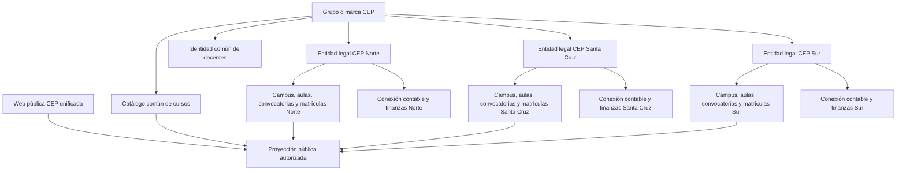

# Plan CEP multi-entidad y Finanzas sin impacto operativo

## Objetivo optimizado

Evolucionar CEP a una arquitectura de grupo educativo multi-entidad que permita
incorporar CEP Sur y un módulo financiero de solo lectura, manteniendo una web
pública unificada, un catálogo común de cursos y una identidad común de
docentes, mientras aísla por entidad legal convocatorias, sedes, aulas,
matrículas, leads, campañas, costes y finanzas.

La evolución debe ser aditiva, observable, reversible y compatible con la
operativa actual. Los roles, permisos, membresías y accesos efectivos de todos
los usuarios permanecerán exactamente como están durante la implementación.
Solo cuando el modelo completo haya superado staging, backfill, modo sombra,
pruebas de aislamiento y rollback se preparará una matriz nominal y se cambiará
manualmente cada usuario, uno a uno y con autorización expresa.

## Invariantes

1. **Cero cambios de acceso durante la construcción.** La política futura puede
   calcular divergencias, pero la decisión efectiva sigue siendo la actual.
2. **Finanzas no se hereda de Operaciones.** Cada capacidad financiera es
   explícita y pertenece a una entidad legal concreta.
3. **Sin consolidación financiera por defecto.** Una sesión consulta una sola
   entidad legal; incluso el administrador general debe seleccionar entidad y
   poseer membresía financiera explícita.
4. **Cursos y docentes se comparten como identidad.** Precios, acuerdos,
   disponibilidad, convocatorias y costes son relaciones locales.
5. **Campus no equivale a entidad legal.** Un campus pertenece a una entidad;
   la frontera de seguridad primaria es la entidad legal.
6. **CEP Sur es el piloto.** No se recortan ni reinterpretan datos de los centros
   actuales para poder crearla.
7. **Integración contable read-only.** El sistema externo solo se lee; las
   credenciales se separan por entidad y se guardan en un gestor de secretos.

El contrato transversal `packages/tenant/src/multi-entity-runtime-scope.ts`
queda preparado para observar `enrollment`, `course_run`, `campaign`, `lead` y
`media` con el scope explícito `tenant + legal_entity + campus`. En `lead`
solo proyecta tenant, sede y la relación opcional de campaña, sin PII. Solo
admite `disabled` o `shadow`, conserva siempre `legacyAllowed` como decisión
efectiva y expone `canApply: false` y `changePermissions: false`. No está
conectado a ACL, endpoint, job ni permisos actuales; su activación requiere
snapshots de staging, backfill revisado y una puerta posterior de autorización.

El runner separado
`packages/tenant/src/multi-entity-runtime-scope-runner.ts` añade una segunda
barrera: `AKADEMATE_CEP_RUNTIME_SCOPE_SHADOW_ENABLED=true`,
`AKADEMATE_MULTI_ENTITY_RUNTIME_SCOPE_MODE=shadow` y
`AKADEMATE_CEP_MULTI_ENTITY_ENVIRONMENT=staging`. Rechaza producción y formas
de snapshot desconocidas antes de cargar datos, limita el lote a 10.000
registros y emite únicamente métricas agregadas por tipo y motivo. No devuelve
IDs, scopes ni datos del recurso y no tiene callback de escritura, aplicación o
cambio de permisos.

El adaptador preparatorio
`apps/tenant-admin/src/multi-entity/runtime-scope-payload-snapshot-loader.ts`
puede construir ese snapshot a partir de un `PayloadRequest` ya autenticado,
sin crear una nueva vía de acceso. Solo consulta con `overrideAccess: false`,
`depth: 0`, selección mínima, filtros por tenant y paginación estable los
recursos `course-runs`, `enrollments`, `campaigns` y `leads`; en `leads` solo
proyecta `tenant`, `campus` y la relación opcional `campaign`, sin PII. La
relación de matrícula se valida contra el `course_run` revisado y la relación
de campaña de un lead se contrasta con una campaña revisada del mismo scope.
La topología `tenant + entidad legal + campus` se valida con el validador
canónico antes de cualquier lectura y las resoluciones `review://` se
deduplican y limitan a 10.000 registros. `media` se rechaza cerrado mientras
no exista una fuente de propietario segura. El módulo es inyectado, no está
registrado en Payload, ACL, endpoint, job, cron ni hook, y no cambia roles,
memberships, permisos ni datos; las resoluciones revisadas son evidencia
shadow y no sustituyen todavía campos de esquema ni una prueba de aislamiento
en staging.

## Cierre automático de matrículas y publicidad

### Separación de estados

El estado operativo de la convocatoria (`próximamente`, `en curso`,
`finalizada`) es independiente de su estado comercial (`matrículas abiertas` o
`matrículas cerradas`). Una convocatoria puede continuar pública y en curso
aunque ya no admita nuevas matrículas.

### Cursos ordinarios

La matrícula permanece abierta mientras queden plazas, no haya comenzado la
séptima sesión y no exista cierre manual. El inicio del curso por sí solo no la
cierra. Las seis primeras sesiones admiten incorporaciones; el cierre se
produce al comenzar la séptima sesión. Se cierra antes si el aforo se completa
o un responsable realiza un cierre manual.

### Ciclos formativos

Los ciclos no usan el límite de seis sesiones. Permanecen abiertos hasta que se
complete el aforo, termine la fecha oficial anual comunicada por la Consejería
de Educación o exista cierre manual. La fecha oficial es configurable por
convocatoria y curso académico. Se considera inclusiva: la matrícula se cierra
al día siguiente en `Europe/Madrid`. Si falta, shadow mode bloquea la decisión y
emite una alerta; nunca inventa una fecha.

### Badge y experiencia pública

- Abierta: badge verde y CTA de reserva.
- Cerrada: badge ámbar o naranja, nunca rojo.
- La convocatoria cerrada sigue visible si continúa en curso.
- El CTA de matrícula se sustituye por solicitud de aviso o información.
- El motivo detallado queda en administración; públicamente basta
  `Matrículas cerradas`.

### Publicidad

Las campañas explícitamente ligadas a la convocatoria se proponen para pausa
cuando se complete el aforo, comience la séptima sesión, venza el plazo oficial
del ciclo o exista cierre manual. La decisión se limita a
`tenant + entidad legal + convocatoria`, es idempotente y auditable. Liberar
posteriormente una plaza no reactiva publicidad automáticamente; cualquier
reactivación será manual para evitar gasto inesperado.

La asociación y visualización convocatoria–campaña se rige por el
[plan de corrección Meta Ads](./2026-07-24-meta-campaign-convocatoria-correction.md).
Ese plan es un gate previo a cualquier escritura publicitaria: hasta que la
relación directa, el estado live, el aislamiento y el rollback estén validados,
el motor de cierre solo puede emitir propuestas shadow y nunca pausar anuncios.

El gate consume exclusivamente la lectura por convocatoria
`GET /api/convocatorias/{convocatoriaId}/campaign`, no una búsqueda global por
curso o ciclo. Esta lectura conserva el scope completo `tenant_id +
legal_entity_id + campus_id + convocatoria_id`; si la entidad o sede solo
pueden proponerse, están ausentes o no coinciden, el resultado es
`unavailable`, no una campaña elegible. `snapshot` fechado y `unavailable` son
estados operativos distintos: el primero solo informa de una observación vieja
del mismo scope y el segundo bloquea cualquier propuesta de pausa. Los enlaces
internos y a Ads Manager no incluyen tokens ni secretos.

### Implantación segura

1. Motor puro de decisión, sin I/O ni escrituras.
2. Runner detrás de `AKADEMATE_CEP_ENROLLMENT_CLOSURE_SHADOW_ENABLED` y
   exclusivamente en `staging`.
3. Snapshot Payload acotado de convocatoria y sesiones, más campañas vinculadas
   por entidad.
4. Observación agregada sin IDs, importes ni datos personales.
5. Comparación entre estado actual y recomendado.
6. Validación de aforo, sexta/séptima sesión, ciclos, datos incompletos y cruces
   de entidad.
7. Activación gradual comenzando por CEP Sur, con rollback por convocatoria.

Durante shadow mode no se actualiza `enrollment_status`, no se rechazan
matrículas que hoy serían aceptadas y no se llama a Meta Ads. Los roles,
permisos, memberships y accesos actuales permanecen intactos.

### Estado implementado del snapshot de cierre

El adaptador preparatorio ya puede formar un snapshot de una convocatoria
revisada usando el `PayloadRequest` y el usuario actuales. Consulta
`course-runs` y `course-run-sessions` con `overrideAccess: false`, filtros
explícitos de tenant y convocatoria, selección mínima, paginación estable y
límites duros. Una sesión cruzada, un duplicado o un cambio de paginación
detienen el snapshot completo.

Las campañas se leen de `meta_ad_drafts` mediante un único `SELECT` acotado por
`tenant_id + convocatoria_id`. El reader no crea la tabla, no consulta copy,
presupuesto, assets o credenciales y no contiene operaciones de escritura. La
entidad legal continúa llegando de una resolución `review://` porque el esquema
legado aún no registra ese campo; por ello este adaptador permanece desconectado
y no constituye evidencia de aislamiento real en staging. Ya existe una
composición lazy con el runner: con el flag apagado, entorno inválido o
`production` devuelve `skipped` antes de consultar Payload o Meta; en `staging`
solo puede devolver una observación redactada con `canWrite: false` y
`canPauseAds: false`. La composición no está registrada en endpoint, job, cron
ni hook.

La validación local cubre autenticación presente, preservación del access
control vigente, cruce de tenant, drift de paginación, errores sanitizados,
revisión de scope, límites de campañas y ausencia de SQL mutante. Pendientes
antes de cualquier activación: ejecutar con un request real de staging, validar
la resolución revisada de entidad, contrastar el estado del workflow con Meta
live, definir un entrypoint operativo de observación y obtener ejecuciones
repetibles. Ninguno de estos pasos cambia permisos ni autoriza a actualizar
matrículas o pausar anuncios.

El gate `enrollment_closure_shadow_verified` dispone además de un artefacto
content-addressed que ejecuta el planificador real sobre nueve casos
obligatorios: antes del inicio, aforo completo, sexta y séptima sesión, ciclo
antes y después del plazo oficial, ciclo sin fecha, cruce de scope y campaña
pausada bajo cierre manual. También ejecuta el gate real del runner para
comprobar flag apagado, entorno inválido, prohibición de producción y staging
permitido. La matriz solo genera observaciones redactadas y propuestas; no
invoca el loader, no actualiza matrículas y no pausa ni reactiva anuncios. Su
bridge propone revisión manual, no acredita una ejecución real en staging.

## Topología objetivo



## Bloqueo P0: autoridad de base de datos

Hoy existen dos definiciones incompatibles de tablas homónimas:

- Payload en `apps/tenant-admin`, con IDs numéricos, es la ruta funcional CEP.
- Drizzle en `packages/db`, con IDs UUID, es una base de plataforma distinta.
- El script genérico de despliegue intenta ejecutar Drizzle automáticamente.

Antes de crear tablas multi-entidad se debe escoger una de estas rutas:

1. **Recomendada para continuidad inmediata:** Payload es autoridad CEP; crear
   colecciones y migraciones Payload aditivas y retirar Drizzle del despliegue
   CEP.
2. **Control plane separado:** mantener Drizzle en otra base/servicio, con
   nombres, credenciales y ciclo de migración propios; CEP consume su API.
3. **Consolidación total:** migración integral hacia una única autoridad. Es la
   opción de mayor riesgo y no debe mezclarse con la incorporación de CEP Sur.

No se debe aplicar ninguna migración multi-entidad hasta tomar y ensayar esta
decisión en una copia restaurada de producción.

El gate `schema_authority_decided` dispone ahora de un artefacto declarativo
que registra si la autoridad propuesta es `payload` o `drizzle_control_plane`.
El artefacto exige una referencia de decisión independiente, conserva solo
digests y mantiene `productionMigrationApplied`, `productionBackfillApplied` y
la activación en `false`. Su veredicto es
`review_recorded_no_execution_authority`: no demuestra que la autoridad haya
sido aprobada, que se haya leído el esquema real o que staging esté listo.

## Fases de implantación

### Fase 0 — Congelación y evidencia

- Inventario de tablas, rutas, jobs, exports, cachés y usuarios actuales.
- Snapshot nominal de acceso efectivo por usuario.
- Backup restaurable y ensayo de rollback.
- Métricas base de errores, latencia y operaciones críticas.

**Salida:** línea base reproducible sin modificar producción.

### Fase 1 — Autoridad y control plane

- Resolver el bloqueo Payload/Drizzle.
- Preparar las colecciones Payload de entidad legal, vínculo sede-entidad,
  asignación docente-entidad y conexión contable detrás de una doble barrera:
  flag explícito + entorno no productivo explícito.
- Mantener esas colecciones ocultas y con acceso denegado para todos los
  usuarios hasta que existan migración, staging y autorización de activación.
- Crear grupo, entidades legales, campus y membresías futuras de forma aditiva.
- Membresías nuevas suspendidas y sin capacidades por defecto.
- Mantener el evaluador únicamente en `disabled` o `shadow`.

**Salida:** estructuras vacías y desconectadas; acceso efectivo idéntico.

### Fase 2 — Propiedad compartida y local

- Mantener una identidad común para curso y docente.
- Crear asignaciones docente-entidad con disponibilidad y condiciones locales.
- Validar en shadow mode los solapes por identidad maestra del docente a través
  de todas sus asignaciones por entidad; mantener el resultado sin escritura ni
  efecto sobre el hook operativo actual hasta superar staging y aprobar la
  activación.
- Proyectar snapshots Payload ya leídos mediante un adaptador puro que normalice
  relaciones, fechas y horas actuales. La entidad legal debe llegar explícita o
  desde una resolución shadow revisada; una sede nunca basta para inferirla.
- Ejecutar esta observación únicamente cuando
  `AKADEMATE_CEP_TEACHER_SCHEDULE_SHADOW_ENABLED=true` y
  `AKADEMATE_CEP_MULTI_ENTITY_ENVIRONMENT=staging`. El contrato rechaza
  producción incluso con la bandera activa y solo devuelve métricas agregadas.
- Cargar las convocatorias mediante páginas estables, acotadas, con `depth: 0`,
  `overrideAccess: false` y `current_effective_access`. Enriquecer `legalEntity`
  solo desde resoluciones
  revisadas y detener el snapshot ante cruces de tenant, duplicados o drift de
  paginación. El adaptador real de Payload permanecerá sin registrar hasta
  resolver la autoridad de esquema.
- Mantener el adaptador Payload preparatorio desconectado. Debe recibir el
  `PayloadRequest` actual, filtrar `course-runs` por tenant, ordenar por ID,
  seleccionar solo relaciones y campos horarios y descartar cualquier campo
  raíz adicional. No seleccionará un `legalEntity` inexistente ni creará un
  usuario técnico con acceso elevado.
- Vincular campus, aulas, convocatorias y matrículas a entidad legal.
- Vincular leads, campañas y gasto publicitario a entidad legal.
- Prohibir combinaciones cruzadas mediante claves y validaciones compuestas.
- Mantener un validador puro de ownership operativo que modele el grafo real:
  curso y docente maestros compartidos; aulas, convocatorias, matrículas,
  campañas, leads y gasto publicitario ligados a una entidad. Una convocatoria
  solo puede usar un aula y una asignación docente de su entidad y sede.
- El cierre fail-closed debe validar primero la topología completa y después el
  ownership de recursos; una topología ambigua nunca puede considerarse válida
  porque los recursos aislados parezcan coherentes por separado.
- Ejecutar ese contrato primero en pruebas y shadow mode. No conectarlo todavía
  a hooks Payload, no registrar campos ni generar migraciones hasta resolver la
  autoridad Payload/Drizzle y aprobar la fase de activación.
- Construir una proyección pública unificada y allow-listed: cada curso maestro
  se emite una sola vez, mientras cada convocatoria conserva una entidad
  validada y una sede unívocamente vinculada. Bloquear toda la salida ante
  cruces de tenant o entidad, sedes ambiguas, entidades propuestas, cursos
  inactivos o slugs duplicados. Compararla en shadow antes de sustituir los
  loaders públicos vigentes.

**Salida:** CEP Sur puede crearse sin filtrar todavía los centros actuales.

### Fase 3 — Backfill y modo sombra

- Mapear cada registro actual a entidad y campus mediante un proceso idempotente.
- Ejecutar primero `dry-run`, luego aplicar por lotes pequeños.
- El planificador preparatorio solo emite operaciones `set_if_null`, conserva el
  valor anterior para rollback y carece deliberadamente de función `apply`.
- Proyectar snapshots Payload ya leídos hacia el contrato de backfill mediante
  una función pura y acotada: normaliza IDs escalares o relaciones pobladas,
  permite que una matrícula herede sede solo de su convocatoria conocida y
  conserva como no resueltas las campañas o gastos sin una sede demostrable.
- Encadenar esta proyección únicamente con el planificador `dry-run`; ambos
  resultados exponen `canWrite: false`/`canApply: false` y no realizan consultas.
- Resolver registros sin sede solo mediante una propuesta explícita con entidad
  y referencia de revisión opaca. El plan vuelve a emitir exclusivamente
  `set_if_null` e incluye una reversión `restore_null_if_unchanged` por registro.
- Validar que toda sede usada para contrastar una propuesta tenga una única
  vinculación activa hacia una entidad existente y activa; una autoridad de
  topología duplicada, ausente o inactiva bloquea la resolución.
- Permitir que gasto publicitario herede entidad de su campaña únicamente si la
  campaña ya fue resuelta, ambos pertenecen al mismo tenant y no existe una
  asignación contradictoria. Cualquier contradicción bloquea el plan completo.
- Unificar ambos caminos en un único ledger shadow: asignaciones por sede,
  revisiones explícitas y herencias campaña-gasto. El informe debe demostrar
  cobertura por registro, impedir solapamientos y adjuntar rollback individual
  sin exponer una función de aplicación.
- Exigir y validar la topología completa antes de declarar el ledger listo; una
  ambigüedad fuera del lote observado también bloquea la cobertura global.
- Bloquear sedes sin mapa, mapas ambiguos, registros de otro tenant, duplicados
  y cualquier entidad ya asignada que contradiga la propuesta.
- Comparar la decisión actual con la futura sin cambiar respuestas.
- Observar solo métricas agregadas por capacidad (`wouldGrant`, `wouldRevoke`,
  alineadas y divergencias), sin copiar identificadores de usuario, entidad,
  sede o membership a la telemetría.
- Para el ledger de datos, observar únicamente contadores de cobertura,
  propuestas por origen e incidencias por etapa. Excluir IDs de tenant, entidad,
  sede, registro, referencias de revisión, importes y payloads financieros.
- Validar la coherencia interna del ledger antes de emitir telemetría y rechazar
  observaciones manipuladas, límites excesivos o desbordamientos numéricos.
- Generar un manifiesto de evidencia determinista exclusivamente desde esa
  telemetría validada. El manifiesto no contiene fecha, ID ni firma implícita,
  mantiene `canWrite: false`/`canApply: false`, y una colección vacía se declara
  `insufficient_evidence`, nunca lista.
- Ejecutar una observación mediante un runner independiente que solo se habilita
  con flag explícito y entorno `staging` explícito. Con el gate cerrado no debe
  invocar siquiera el loader; habilitado solo acepta una función de lectura,
  realiza una carga y devuelve el manifiesto sin registrar endpoint, job o
  persistencia.
- Redactar los fallos del loader o del planificador mediante códigos estáticos;
  nunca devolver mensajes del proveedor, snapshots ni credenciales.
- Investigar toda divergencia en flujos críticos.

**Salida:** 100 % de registros locales reconciliados; cero huérfanos y cero
divergencias inexplicadas.

### Fase 4 — Finanzas read-only

- Una conexión y una referencia de secreto por entidad legal.
- El adaptador de lectura debe coincidir exactamente con el proveedor de la
  conexión; identificadores no canónicos o cualquier modo distinto de
  `read_only` fallan antes de iniciar una sincronización.
- El coordinador valida el lote completo antes de cualquier I/O, ejecuta una
  conexión por entidad en orden determinista y contiene los fallos por entidad;
  no produce una vista financiera consolidada.
- Ingesta paginada, acotada e idempotente por identificador externo.
- Normalización sin payloads crudos ni secretos en errores.
- RLS por tenant y entidad legal.
- Cruces con matrículas y publicidad mediante relaciones locales auditables.
- Mantener desconectado el lector Payload preparatorio de relaciones: recibe el
  `PayloadRequest` vigente y un plan revisado por entidad, filtra matrículas por
  `course_run.tenant` y campañas por su `tenant`, exige cobertura exacta de IDs,
  usa `depth: 0`, `overrideAccess: false` y selección mínima, y elimina PII antes
  de devolver el snapshot. Requiere un usuario autenticado y un bridge revisado
  que separe `payloadTenantId`, numérico y usado únicamente en las consultas,
  del `tenantId` financiero canónico emitido en el snapshot. Todos los planes
  deben coincidir con el tenant Payload del usuario y el superadmin técnico se
  rechaza como sustituto de un contexto empresarial. La entidad legal nunca se
  infiere de Payload. Este bridge evita mezclar namespaces, pero no resuelve por
  sí mismo la decisión de autoridad Payload/Drizzle ni crea IDs persistidos.
- Componer una sola configuración financiera con un único plan Payload revisado
  y readers contable/operativos inyectados. La composición app-level exige que
  tenant y entidad coincidan exactamente antes de crear el runner, conserva el
  contexto autenticado y soporta `cep_sur_pilot` solo con una revisión de piloto
  independiente. Con el flag apagado o en producción no consulta ninguna de las
  cinco fuentes; en staging devuelve exclusivamente evidencia redactada. Sigue
  sin registrarse en endpoint, job, cron, hook o configuración Payload.
- Tratar eventos de pago y gasto publicitario diario como fuentes separadas: no
  existen como colecciones actuales de Payload y no pueden reconstruirse desde
  `amount_paid` ni desde el presupuesto de campaña.
- Configurar cada fuente externa mediante una conexión identificada, `active` y
  `read_only`, una cuenta asignada a una sola entidad y relaciones
  matrícula/campaña revisadas. El adaptador inyectado pagina con límites,
  detecta cursores cíclicos y duplicados, sanitiza fallos y descarta campos no
  incluidos en el snapshot. No almacena credenciales ni registra ejecución.
- Resolver una conexión contable únicamente desde la clave completa
  `tenantId + legalEntityId + connectionId` y un registro `review://` validado.
  Validar el conjunto completo antes de invocar adaptadores; rechazar entidades,
  conexiones o cuentas externas compartidas. El adaptador recibe una referencia
  opaca compatible con el gestor de secretos, nunca la credencial, y el resolver
  proyecta su resultado a `provider + listTransactions` para descartar cualquier
  propiedad adicional sensible.
- Ejecutar la observación mediante una composición unientidad: contabilidad,
  matrículas, campañas, cobros y publicidad se cargan secuencialmente para una
  sola entidad. La composición no ofrece batch multiempresa, store ni callback
  de escritura, y no expone su configuración en el resultado.
- Leer las transacciones ya importadas mediante un repositorio inyectado que
  filtre por tenant, entidad y conexión revisada, ordene por `external_id_asc` y
  mantenga una versión de snapshot constante entre páginas. Rechazar cambios de
  versión, desorden, duplicados, conexiones compartidas y cruces de scope antes
  de conciliación. El reader solo devuelve los campos mínimos del pipeline.
- Proyectar únicamente cobros individualizados con fecha e importe; el
  acumulado `enrollments.amount_paid` actúa como total de control y nunca se
  convierte por sí solo en un movimiento inventado. Una discrepancia entre
  eventos y acumulado bloquea la matrícula completa.
- Proyectar gasto publicitario únicamente con granularidad diaria, moneda
  explícita, métrica disponible y campaña ya asignada a la misma entidad. Los
  rangos Meta de varios días no son conciliables como un único gasto fechado.
- La conciliación empieza como propuesta determinista: filtra primero por
  tenant y entidad, nunca confirma automáticamente coincidencias ambiguas y no
  muta la contabilidad ni los registros operativos.
- La conciliación batch acepta exclusivamente un tenant y una entidad, valida el
  lote completo y limita el número de comparaciones. Si un cobro de matrícula o
  gasto publicitario aparece como candidato de varias transacciones, todas las
  recomendaciones afectadas quedan en conflicto y requieren revisión humana.
- El compositor de lectura exige que tenant, entidad y conexión coincidan con
  las transacciones contables importadas y con el objetivo de la proyección
  operativa. Si la proyección contiene una sola incidencia, devuelve estado
  `blocked` y no genera conciliación, aunque existan registros parciales válidos.

### Estado implementado del registro de fuentes contables

Existe un resolver puro e inyectado para registros contables revisados. Acepta
únicamente conexiones activas y `read_only`, identificadores canónicos, una
referencia `review://` y localizadores opacos `op://`, `vault://`, `aws-sm://` o
`gcp-sm://`. La validación completa ocurre antes de que una factoría pueda
resolver el secreto o crear el cliente. Una petición cruzada no invoca el
adaptador; sus fallos se convierten en códigos estáticos y el cliente devuelto
se reduce a la interfaz mínima de lectura.

El resolver también prepara lotes independientes de un solo tenant. Primero
valida todas las claves y límites, rechaza entidades o conexiones duplicadas y
ordena por entidad y conexión; solo entonces crea los clientes secuencialmente.
Cada entidad debe recibir una instancia distinta incluso si las tres empresas
usan el mismo proveedor contable. El lote devuelve fuentes aisladas y no
transacciones, totales ni una vista financiera consolidada.

La autorización financiera futura tiene ahora un contrato específico y
desconectado del runtime en `packages/finance/src/read-authorization.ts`.
Solo puede proponer lectura cuando coinciden el usuario, el tenant, la entidad
legal, una conexión contable revisada y una membresía activa con capacidad
explícita `finance.read`. `finance.manage` no se convierte implícitamente en
lectura, una conexión `write` o inactiva se rechaza y un superadmin de
plataforma sin membresía empresarial no es autoridad financiera. El contrato
solo admite `disabled` o `shadow` mediante
`AKADEMATE_CEP_FINANCE_AUTHORIZATION_MODE`; cualquier otro valor vuelve a
`disabled`. En ambos modos `effectiveAllowed` sigue siendo la decisión legacy,
`canApply` y `canChangePermissions` son siempre `false`, y no existe rama de
enforcement ni cambio de memberships.

La validación local incluye los casos adversariales del contrato de autorización,
roster completo de entidades, referencias de secreto/revisión no compartidas,
permisos read-only scope-bound, límites de paginación y consistencia de snapshot,
y eleva la suite de Finanzas a 459 tests pasados. Los readers de cobros y publicidad exigen `snapshotVersion`
estable en todas las páginas y rechazan deriva o versiones vacías antes de
proyectar datos. Esta evidencia es de código local: no
demuestra todavía que existan membresías nominales, conexiones reales ni una
ejecución autenticada en staging, y el módulo no está registrado como ruta,
job, hook o selector de acceso.

Sobre ese límite existe ahora una proyección pura en
`packages/finance/src/read-overview.ts`. Recibe únicamente una decisión futura
`membership_allows`, una vinculación explícita de scope y un snapshot de una
sola entidad; produce totales contables y operativos por moneda, conteos de
estado y resumen de conciliación sin devolver IDs de transacción, matrícula o
campaña. Una denegación, cruce de scope, dato contable no canónico o proyección
operativa parcial devuelve `blocked` sin métricas parciales. La proyección no
lee proveedores, no persiste, no consolida entidades y no está registrada en
una API o interfaz.

La capa app-level añade ahora
`apps/tenant-admin/src/multi-entity/authorized-finance-entity-shadow-service.ts`.
Evalúa `finance.read` únicamente como propuesta shadow, conserva siempre
`currentEffectiveAllowed` como decisión efectiva y no realiza I/O si esa
decisión legacy deniega, si el entorno no es staging o si cualquiera de los dos
flags de shadow está apagado. Cuando ambos gates están activos, compone una
sola entidad con el `PayloadRequest` autenticado y devuelve únicamente la
observación financiera redactada; mantiene `canWrite:false` y
`canApply:false`. Antes de crear la composición o realizar cualquier lectura,
exige que `authorization.scope.tenantId`,
`authorization.scope.legalEntityId` y `authorization.scope.connectionId`
coincidan exactamente con la configuración de lectores (`tenantId`,
`legalEntityId`, `accountingConnectionId`); cualquier desacoplamiento devuelve
`authorization_scope_mismatch` sin I/O. Sigue sin estar registrado en rutas,
jobs, hooks, ACL o producción y no crea memberships.

La colección Payload sombra reutiliza el mismo validador de referencias, pero
continúa oculta, con acceso denegado y sin registrarse en producción. Este
contrato no implementa todavía un proveedor, no accede a ningún gestor de
secretos, no abre red, no crea jobs y no autoriza sincronización. La conexión
real sigue condicionada a la autoridad de esquema, el mapeo legal revisado, la
documentación del proveedor y el gestor de secretos seleccionados.

Existe además un planner de sincronización detrás de
`AKADEMATE_CEP_FINANCE_ACCOUNTING_SYNC_SHADOW_ENABLED`, habilitable solo en
`staging`. Exige exactamente tres entidades, una única candidata CEP Sur con
revisión independiente, conexiones y stores no compartidos y un solo tenant.
Con el gate cerrado no invoca el resolver; habilitado resuelve las tres fuentes,
valida de nuevo sus scopes y prepara emparejamientos aislados en memoria. No
llama a `listTransactions`, no inicia sincronizaciones, no invoca ningún método
del store y devuelve únicamente cinco contadores constantes redactados con
`canReadProvider: false`, `canWriteProvider: false`, `canWriteLocal: false` y
`canApply: false`. Preparado no significa ejecutado ni validado en staging.

El runner de importación usa un segundo gate,
`AKADEMATE_CEP_FINANCE_ACCOUNTING_IMPORT_STAGING_ENABLED`, también restringido
a `staging`. Reutiliza exactamente el mismo plan revisado y, después de validar
las tres fuentes completas, ejecuta cada importación de forma independiente y
determinista. Su cliente solo expone lectura del proveedor; los únicos writes
permitidos son `beginSync`, `upsertTransactions`, `completeSync` y `failSync`
sobre el store local inyectado de cada entidad. La evidencia emitida contiene
solo entidades intentadas, completadas y fallidas, sin IDs, importes, cursores,
errores, referencias ni credenciales. El runner permanece sin ruta, cron o job;
su existencia local no acredita una ejecución real en staging.

Una observación solo puede convertirse en artefacto content-addressed cuando
las tres entidades terminan correctamente, el runner declara lectura del
proveedor, escritura local y cero capacidad de escritura externa, y la entrada
está vinculada a `staging`, al flag exacto, al SHA fuente, al digest del tenant y
a una revisión `review://`. El artefacto canonicaliza la observación, publica
`artifactDigest` y `evidence://sha256/...` y elimina la referencia de revisión.
Su veredicto es únicamente `eligible_for_manual_staging_binding`: no está
firmado, no demuestra autenticidad y no satisface
`accounting_import_staging_verified` hasta que se genere desde una ejecución
real y se revise dentro del bundle de staging.

El bridge app-level verifica de nuevo la estructura y el hash completo del
artefacto, comprueba que los digests de campaña y readiness coincidan con sus
referencias `review://` y propone exclusivamente el binding global
`accounting_import_staging_verified`. La propuesta conserva
`canBindAutomatically: false` y `canMarkVerified: false`; no modifica el
manifiesto, no añade evidencia a disco y no puede reutilizar un artefacto en
otra campaña o revisión. El bundle general continúa siendo la única pieza que
puede evaluar si el conjunto de 56 bindings está completo y coherente.

Las observaciones de conciliación read-only disponen además de un manifiesto
content-addressed para las tres entidades. Exige un único tenant, entidades,
conexiones y revisiones distintas y exactamente un piloto CEP Sur. Cada
observación se sella en un artefacto de entidad independiente; el manifiesto
queda `blocked` si una de ellas está bloqueada y solo resulta
`eligible_for_manual_staging_binding` cuando las tres están planificadas. La
salida contiene hashes y conteos de entidades, nunca volúmenes contables,
importes, monedas, IDs o referencias legibles, por lo que no crea una vista
financiera consolidada. El verificador recalcula los tres artefactos y el digest
global. No inserta bindings, no marca `finance_shadow_observed` como verificado
y no acredita que las observaciones procedan de un staging real hasta que se
ejecuten y revisen contra el SHA desplegado.

Un bridge app-level convierte ese manifiesto únicamente en una propuesta de
tres bindings `scope: entity` para el gate `finance_shadow_observed`. Revalida
el manifiesto completo, exige que campaña y readiness coincidan con sus digests
y resuelve mediante hash el mapeo explícito uno-a-uno entre cada artefacto y la
revisión de su entidad. Un manifiesto bloqueado, una referencia reutilizada, un
artefacto ausente o un mapeo duplicado fallan antes de producir una propuesta.
La salida es determinista y conserva `canBindAutomatically: false`,
`canMarkVerified: false`, `canDeploy: false`, `canActivate: false` y
`canChangePermissions: false`. Se ha comprobado su compatibilidad estructural
con el bundle completo de 56 controles, pero el bridge no lo persiste ni lo
ejecuta.

**Salida:** tres sincronizaciones independientes verificadas; ninguna llamada de
escritura al proveedor contable.

### Fase 5 — Pruebas de aislamiento

- API, UI, SQL, exports, jobs, notificaciones, cachés y búsquedas.
- Casos negativos entre Norte, Santa Cruz y Sur.
- Ejecutar el harness financiero únicamente con
  `AKADEMATE_CEP_FINANCE_ISOLATION_AUDIT_ENABLED=true` en staging. Exigir
  exactamente tres entidades revisadas, conexiones distintas y un candidato
  piloto CEP Sur. Validar secuencialmente las cinco superficies, detenerse ante
  la primera brecha y emitir solo contadores de conformidad redactados.
- Usuario multi-entidad con selección explícita y sin vista financiera agregada.
- Fallos de contexto, entidad suspendida, campus no asignado y secreto inválido.
- Ensayo de rollback con datos y sesiones activas.
- Generar primero un dry-run de rollback que proponga apagar los ocho feature
  flags reales —siete shadow y uno de importación staging— y devolver
  autorización de `shadow` a `disabled`. Exigir que el
  digest de acceso actual coincida con el baseline. Restaurar asignaciones solo
  mediante `restore_null_if_unchanged`; cualquier cambio posterior al backfill
  bloquea la propuesta correspondiente.
- Generar el manifiesto de preparación con 20 gates globales y 12 gates por
  entidad. Ausencias y pendientes son evidencia insuficiente; cualquier fallo
  bloquea. `ready_for_staging_review` solo permite revisión humana y conserva
  despliegue, migración, activación y cambios de permisos deshabilitados.

**Salida:** pruebas adversariales y observabilidad en staging representativo.

### Baseline ampliado de accesos antes de cambiar permisos

El plan incorpora un baseline offline adicional que cubre usuarios de Payload y
plataforma, memberships con rol/estado y API keys mediante referencias
pseudonimizadas (sin secretos ni hashes de credenciales). La captura y la
comparación unchanged son content-addressed, read-only y fail-closed. Sus
validadores bound reconstruyen el artefacto contra los manifiestos exactos, el
tenant objetivo, las referencias de revisión y los digests de autoridad; así se
rechazan relabelados, sustituciones de contexto y métricas falseadas aunque se
recalcule el hash del artefacto.

El admin solo genera una propuesta de binding para revisión manual. Mantiene
`canBindAutomatically:false`, `canEnterStagingEvidenceBundle:false`,
`canMarkVerified:false`, `canReadRuntime:false`, `canActivateAuthorization:false`
y `canChangePermissions:false`. El compositor strict lo exige como precondición
suplementaria fuera de sus 56 bindings y enlaza sus digests en el
`verificationDigest`; esto no lo convierte en gate de staging ni en autorización.
No se integra aún en ACL, endpoint, job ni producción. La siguiente puerta sigue siendo extraer
el baseline desde una copia restaurada y autenticada de staging, compararlo con
los usuarios reales y conservar el estado nominal actual; después se podrá
aplicar la matriz usuario por usuario, con autorización y rollback individual.

### Fase 6 — Cambio manual de usuarios

- Mantener un lock explícito durante implementación y validación de staging:
  siempre deniega generar matrices nominales, aplicar permisos, realizar cambios
  masivos o utilizar al superadmin técnico como autoridad de negocio, aunque el
  bundle esté listo para revisión manual.
- No incluir una operación de desbloqueo en el contrato de staging. La apertura
  de esta fase requerirá un contrato posterior de validación final, autorización
  manual explícita y rollback individual aprobado.
- Sellar el bloqueo mediante una matriz content-addressed de cuatro casos: las
  dos fases cerradas (`implementation` y `staging_validation`) por las dos
  acciones prohibidas (`generate_nominal_matrix` y
  `apply_permission_change`). Cada caso usa el escenario más permisivo —baseline
  sin cambios, autorización deshabilitada y bundle listo para revisión— y debe
  conservar todas las capacidades nominales en `false`, superadmin prohibido y
  rollback individual obligatorio. El artefacto se liga al SHA, tenant,
  campaña y readiness, omite referencias y datos nominales, y no prueba una
  ejecución real de staging por sí mismo.
- Usar el bridge app-level solo para proponer el binding global
  `nominal_permission_phase_lock_verified`. El bridge recalcula el artefacto y
  los digests de campaña/readiness, mantiene deshabilitados generación,
  aplicación, binding automático, verificación, activación y cambios de
  permisos, y no persiste ni modifica el bundle. Su compatibilidad con los 56
  controles se valida estructuralmente sin abrir la Fase 6.
- Generar matriz nominal: usuario × entidad × campus × capacidad.
- Aprobación de responsables de cada entidad.
- Aplicar un usuario cada vez, con registro de antes/después.
- Verificación inmediata y ventana de reversión individual.
- El administrador técnico no obtiene acceso financiero de negocio por defecto.

**Salida:** usuarios migrados explícitamente; no existe asignación masiva.

### Fase 7 — Retirada del legado

- Solo tras un periodo estable, retirar selectores y rutas heredadas redundantes.
- Convertir campos nullable en obligatorios cuando la reconciliación lo permita.
- Conservar auditoría y rollback de permisos.

## Condiciones para afirmar “sin impacto en producción”

- Las migraciones son expand-only y fueron ensayadas en una restauración real.
- No se usa `PAYLOAD_DB_PUSH` como mecanismo de producción.
- No se registra una migración en una autoridad de esquema equivocada.
- No hay enforcement ni cambio de permisos antes de Fase 6.
- CEP Sur se activa mediante flag/piloto y puede deshabilitarse sin rollback de
  datos.
- Backfills son idempotentes, pausables y medidos.
- Existe rollback técnico y nominal por usuario.

## Contrato de activación del esquema sombra

El código preparatorio solo registra las colecciones multi-entidad cuando se
cumplen simultáneamente estas condiciones:

```text
AKADEMATE_CEP_MULTI_ENTITY_SCHEMA_SHADOW_ENABLED=true
AKADEMATE_CEP_MULTI_ENTITY_ENVIRONMENT=staging
```

Los entornos admitidos son `local`, `development`, `test` y `staging`.
`production`, un entorno ausente o cualquier valor desconocido fallan cerrado y
conservan exactamente la lista de colecciones anterior. Las colecciones sombra
están ocultas y deniegan lectura, creación, modificación y borrado a todos los
usuarios. No se han generado tipos Payload ni registrado migraciones para ellas.
Esta expansión condicional de esquema en `payload.config.ts` es la única
integración runtime deliberada del trabajo preparatorio; el bundle estricto,
Finanzas y los lectores de campañas siguen sin registrarse en rutas, jobs,
hooks o selectores de acceso. Por tanto, la afirmación válida es “sin registro
en producción”, no “sin ningún registro runtime”.

## Contrato del backfill preparatorio

El planificador actual es exclusivamente `dry-run`: `canApply` siempre es
`false` y `fullyMappable` solo afirma que no existen bloqueos conocidos, no que
los datos hayan sido modificados o reconciliados. Las propuestas se ordenan de forma determinista y usan
`operation=set_if_null`, por lo que una futura herramienta de aplicación deberá
comprobar que el campo continúa vacío dentro de la misma transacción. Un valor
existente nunca se sustituye: si contradice el mapa sede-entidad, el lote queda
bloqueado para revisión humana.

La telemetría shadow utiliza una lista cerrada de campos y no incluye IDs. Esto
permite medir divergencias antes del cambio nominal de permisos sin crear un
nuevo repositorio de información personal o financiera.

El manifiesto shadow se serializa en un orden canónico y solo resume contadores
redactados. Sirve para comparar ejecuciones equivalentes; no es una firma, no
acredita autenticidad y no sustituye evidencia de staging o producción.

La observación shadow de conciliación financiera solo puede cargar snapshots si
`AKADEMATE_CEP_FINANCE_RECONCILIATION_SHADOW_ENABLED=true` y
`AKADEMATE_CEP_MULTI_ENTITY_ENVIRONMENT=staging`. No registra rutas, jobs ni
callbacks de persistencia. Su salida contiene únicamente contadores agregados;
omite tenant, entidad, conexión, IDs, importes, monedas, referencias, cuentas y
contrapartes. Una proyección operativa bloqueada se observa como `blocked` y
produce cero transacciones conciliadas.

La composición unientidad conserva `canWrite: false` y `canApply: false` y no
expone una función de agregación entre entidades. Una ejecución marcada como
`cep_sur_pilot` requiere una revisión de piloto independiente de la revisión de
alcance. Esta etiqueta no acredita todavía que exista configuración real de CEP
Sur ni sustituye la validación del identificador legal y la conexión en staging.

El harness de aislamiento financiero usa un flag separado del runner de
conciliación. No conserva snapshots entre entidades ni emite cantidades de
transacciones, matrículas, campañas, cobros o gasto. Una observación `isolated`
es evidencia de contrato bajo readers inyectados; no prueba todavía aislamiento
de API, SQL, cachés, exports o jobs en un despliegue real.

El manifiesto específico de aislamiento sella cuatro observaciones redactadas:
una ejecución positiva de tres entidades y quince superficies, y tres casos
negativos clasificados para cruce de scope, relación cobro–matrícula y relación
gasto–campaña. Exige que los tres casos negativos terminen en
`breach_detected`, pero sus roles son metadatos de revisión y no una inferencia
independiente sobre el contenido original del snapshot. El artefacto y su
bridge solo pueden proponer el binding global
`financial_isolation_harness_verified`; no marcan readiness, no registran una
ejecución real de staging y no conceden escritura, despliegue, activación ni
cambio de permisos.

Los tres gates de entidad `isolation_negative_cases_verified` disponen además
de un runner inyectado independiente por scope. Cada runner liga mediante
digest `tenant + entidad legal + conexión`, ejecuta los tres casos negativos y
produce `gap_detected` si alguno no genera una brecha. El manifiesto conjunto
exige Norte, Santa Cruz y un único piloto Sur, nueve casos negativos, entidades
y conexiones distintas y reviews no reutilizadas. Emite un artefacto por
entidad y su bridge solo propone los tres bindings correspondientes; no
convierte las etiquetas de escenario en prueba autónoma de staging.

El loader preparatorio se compone exclusivamente con readers inyectados y los
ejecuta de forma secuencial y acotada. Solo el reader contable recibe
`connectionId`; matrículas, eventos de pago, campañas y gasto publicitario
reciben únicamente tenant y entidad. No descubre fuentes, no registra un
adaptador Payload/Meta y no infiere pagos desde `amount_paid` ni moneda desde la
interfaz actual de campañas. Un fallo detiene las lecturas posteriores y se
convierte en un error sanitizado sin conservar el mensaje del proveedor. Antes
de formar el pipeline, la transacción contable se reduce a identificador,
scope, tipo, estado, fecha, importe, moneda y referencia; no arrastra
descripción, contraparte, cuenta, centro de coste, hash ni propiedades extra.
El reader del repositorio contable materializa directamente esa proyección
mínima, valida orden y versión estable y sigue sin implementación SQL hasta que
se resuelva la autoridad Payload/Drizzle o se apruebe una base separada.

La revisión de conexiones contables dispone de un manifiesto separado del gate
de secretos y del contrato del proveedor. Exige tres conexiones activas,
`read_only`, una por entidad, identificadores de conexión distintos, compañías
externas no compartidas y un único piloto CEP Sur. El artefacto no acepta
`secretReference`; conserva únicamente digests de scope, binding de conexión y
empresa externa. Su estado `configured_not_resolved` acredita revisión
estructural, no resolución de credenciales ni conectividad live.
El compositor exige además que ese mismo `scopeDigest` coincida, por review de
entidad, con los artefactos de casos negativos y conciliación; compartir un
review con scopes distintos falla cerrado.

La configuración de referencias de secretos tiene un artefacto independiente.
Solo acepta localizadores opacos `op://`, `vault://`, `aws-sm://` o
`gcp-sm://`, exige una referencia exclusiva por entidad y nunca serializa el
locator. La salida conserva su digest, el backend no secreto y
`reference_configured_not_resolved`; mantiene `canResolveSecret: false` y
`canReadCredential: false`. El compositor exige que su `scopeDigest` coincida
con la conexión revisada, pero no afirma que el secreto exista o sea accesible.

El contrato del proveedor contable también se revisa mediante un artefacto
separado y no invocante. La inspección acepta únicamente el identificador del
proveedor y la operación `listTransactions`, ligada al mismo tenant, entidad,
conexión y empresa externa ya revisados. El contrato fija paginación por cursor,
tamaño de página entre 1 y 500, un máximo de 1000 páginas y detección obligatoria
de ciclos. No llama a la API, no resuelve credenciales, no permite escritura en
el proveedor y no conserva payloads crudos. El compositor compara tanto el
`scopeDigest` como el digest conjunto de proveedor y empresa externa contra la
conexión contable; una sustitución válida pero perteneciente a otra empresa
falla cerrada. Esta evidencia acredita la forma estática del adaptador
inyectado, no conectividad, autenticación ni respuestas reales del proveedor.

La fuente externa de cobros cuenta con su propio contrato no invocante. Cada
entidad declara una conexión de pagos `active` y `read_only`, una cuenta externa
exclusiva y al menos una relación matrícula externa–matrícula local revisada.
La inspección solo admite `provider + listPaymentEvents`; rechaza métodos
adicionales, proveedores discordantes, relaciones duplicadas o ambiguas y no
llama al cliente. La evidencia elimina cuentas, conexiones e identificadores de
matrícula y conserva únicamente digests del scope contable, del scope de pagos,
de la pareja proveedor–cuenta y del mapa de relaciones. El compositor cruza el
scope contable con la conexión ya revisada para impedir que una fuente válida se
reasigne a otra empresa. La paginación se limita a 1000 elementos por página y
1000 páginas, con detección obligatoria de ciclos. Este artefacto demuestra la
forma y asignación del contrato inyectado; no acredita que la cuenta exista,
que las relaciones procedan del sistema real ni que la API responda.

La fuente de gasto publicitario replica ese aislamiento con una conexión y
cuenta publicitaria exclusiva por entidad. Solo admite
`provider + listDailyAdvertisingSpend` y mappings revisados entre campañas
externas y locales. El contrato exige granularidad diaria, moneda explícita y
los cuatro estados de métrica `loaded`, `zero_real`, `not_available` y
`api_error`; no confunde presupuesto con gasto real ni permite rangos agregados.
La evidencia recalcula las huellas desde los mappings y elimina cuentas,
conexiones e IDs de campaña. El compositor cruza el scope contable con la
conexión revisada de la misma empresa. No invoca Meta, no resuelve credenciales,
no pausa campañas y no acredita que la cuenta o los datos existan en staging.

El alcance de relaciones Payload dispone ahora de una evidencia cruzada con
ambas fuentes externas. Para cada entidad, el constructor recibe el plan
revisado de matrículas, convocatorias y campañas, junto con los mappings de
cobros y publicidad y sus artefactos previamente sellados. Recalcula las
huellas externas y exige que todos los IDs locales sean enteros positivos y
coincidan exactamente con `enrollmentIds` y `campaignIds`; ninguna entidad
puede compartir matrículas, convocatorias o campañas con otra. El
`payloadTenantId` numérico se conserva en un namespace separado del tenant
financiero y debe ser común al contexto Payload autenticado, mientras la entidad
legal continúa procediendo exclusivamente del plan revisado. La salida elimina
todos los IDs y mantiene `canReadPayload`, `canInvokeProvider` y
`canUsePlatformSuperadmin` en `false`. Esta evidencia prueba coherencia del plan
recibido, no que Payload se haya consultado ni que esos IDs existan actualmente.

## Contrato de la proyección web pública

La proyección shadow del catálogo compartido y las convocatorias locales es
pura, acotada y determinista. Expone únicamente slug y título del curso; slug,
estado, fecha, modalidad y sede pública de la convocatoria; y slug, nombre,
ciudad y disponibilidad agregada de la sede. La vista pública nunca devuelve IDs
de origen, tenant, entidad legal o binding. Las incidencias identificadas quedan
en el plan diagnóstico interno y no forman parte de la observación persistible.
Los cursos activos sin convocatoria permanecen
en el catálogo maestro y las convocatorias `draft` o `cancelled` se ignoran.

Una sola incidencia invalida la salida completa. La observación serializable se
reduce a contadores y un veredicto `ready_for_shadow_comparison`; no incluye
nombres, slugs o fechas y no autoriza publicar ni activar.

El reader Payload preparatorio consulta secuencialmente cursos, ciclos y sedes
activos y convocatorias públicas, con páginas estables, selección mínima, `depth: 0`,
`overrideAccess: false` y el request actual. Enriquece la entidad únicamente con
resoluciones `review://` revisadas y de cobertura exacta. Elimina importes,
ocupación, contactos y campos internos. Una convocatoria puede depender de un
curso o de un ciclo compartido, pero nunca de ambos ni de ninguno; esos casos
fallan cerrados para evitar exclusiones o duplicidades silenciosas.

El runner solo carga con
`AKADEMATE_CEP_PUBLIC_PROJECTION_SHADOW_ENABLED=true` y
`AKADEMATE_CEP_MULTI_ENTITY_ENVIRONMENT=staging`; producción permanece cerrada
aunque el flag esté activo. Compara cursos, ciclos, sedes y convocatorias contra un
baseline inyectado y persiste únicamente contadores redactados. Sigue sin
endpoint, job ni integración con `WebsiteRenderer`. Ya existe un adaptador
desconectado que reproduce los filtros y límites de los cuatro catálogos
canónicos actuales y solo conserva slugs públicos, pero aún no se ha ejecutado
contra staging. Una composición también une ambos snapshots detrás del gate,
sin I/O cuando está apagado o en producción y sin registro en rutas o jobs. Por
sí sola, esta composición todavía no demuestra igualdad con la web actual. El
gate `unified_public_web_reviewed` añade ahora un
artefacto content-addressed que exige tres observaciones alineadas, cubriendo al
menos tres sedes y tres convocatorias públicas. La salida sigue sin publicar,
activar ni modificar permisos, y no expone entidad legal, tenant o IDs de
origen. Además, conserva tres digests de observación distintos y los ordena
canónicamente, por lo que tres referencias repetidas no se aceptan como
ejecuciones independientes.

Para solicitar esa revisión se requieren tres ejecuciones independientes y
alineadas de la comparación shadow, cada una asociada a una referencia de
evidencia distinta. El agregador devuelve `insufficient_evidence`, `divergent`,
`blocked` o `ready_for_staging_review`; ningún estado habilita publicación,
activación o cambios de permisos. La referencia incorporada posteriormente al
manifiesto general debe apuntar al artefacto revisado, no a una ejecución
individual.

El gate `access_baseline_captured` se materializa mediante un snapshot mínimo
de usuarios: ID técnico, rol, tenant y estado activo, incluyendo por separado
los superadmins de plataforma. Se excluyen todos los datos personales y de
autenticación. El digest resultante incorpora obligatoriamente el SHA-256 del
artefacto RBAC revisado, por lo que detecta tanto cambios de asignación como
drift de política. El reader requiere auditoría de plataforma justificada para
obtener cobertura completa, pero no crea ni utiliza superadmin como rol de
negocio. El mismo digest se vuelve a capturar antes del rollback; cualquier
diferencia bloquea el ensayo.

La captura se sella como `cep_access_baseline_capture_evidence` y la comparación
exacta posterior como `cep_access_baseline_unchanged_evidence`. El segundo
artefacto incorpora el digest del primero y solo puede emitirse cuando los
digests capturado y actual, el número de usuarios y la política coinciden. Su
bridge propone exclusivamente los gates `access_baseline_captured` y
`access_unchanged_verified`; no captura usuarios, no marca readiness y no puede
activar autorización ni modificar permisos. Ambos artefactos prueban coherencia
content-addressed del material recibido, no que el snapshot haya sido extraído
realmente de producción ni que cuente con firma externa.

El digest de política se obtiene de un inventario reproducible de las fuentes
RBAC activas. El generador descubre middleware, roles, filtros tenant, ACL de
colecciones, rutas de autenticación y decisiones de visibilidad; excluye tests,
tipos generados y el nuevo código shadow desconectado. El artefacto no contiene
código fuente: solo rutas, tamaños y hashes. Debe ejecutarse sobre el SHA exacto
de staging, revisarse y conservarse como evidencia. Un digest calculado en un
worktree local cambiante es diagnóstico y no satisface por sí solo
`access_baseline_captured`.

Los gates `all_feature_flags_default_off` y `authorization_shadow_verified`
cuentan con artefactos separados. El primero exige los ocho flags booleanos en
`false` y `AKADEMATE_MULTI_ENTITY_AUTHORIZATION_MODE=disabled`. El segundo
sella cuatro observaciones que cruzan legacy permite/deniega con propuesta
permite/deniega; en las cuatro, `decisionSource` y la decisión efectiva siguen
siendo legacy. La matriz exige dos divergencias observables y cero diferencias
entre legacy y el resultado efectivo. Su bridge solo propone bindings: no puede
encender flags, imponer la propuesta, activar autorización ni modificar
permisos. Los digests demuestran coherencia del estado recibido, no que la
configuración haya sido leída de producción ni que staging se ejecutara.

## Contrato del manifiesto de preparación de staging

El manifiesto exige exactamente Norte, Santa Cruz y un único candidato piloto
CEP Sur bajo el mismo tenant, con entidades, conexiones contables y referencias
de revisión diferentes. Sus 56 checks solo aceptan estados `verified`, `pending`
o `failed`; un check omitido se contabiliza como `missing`. Un estado
`verified` requiere una referencia `evidence://` propia, aunque esa referencia
continúa necesitando validación humana o automatizada contra el artefacto real.

La serialización es determinista e independiente del orden de las entidades.
Omite tenant, entidad, conexión y referencias, y no contiene fecha, firma ni ID
de manifiesto. Por tanto, sirve como checklist reproducible y fail-closed, no
como firma, autorización de despliegue ni prueba de staging ejecutado.

## Bundle consistente de evidencias de staging

El manifiesto de preparación se acompaña de un bundle puro que liga cada
referencia de evidencia con su gate, su revisión global o de entidad, una única
campaña, el digest exacto de la fuente y un digest anonimizado del tenant. El
bundle exige correspondencia uno a uno con todas las evidencias referenciadas;
rechaza mezclas de campañas o fuentes, duplicados, reasignaciones y artefactos
adicionales no declarados.

Las referencias aceptadas por el bundle son content-addressed:
`evidence://sha256/<digest-del-artefacto>`. No se permite declarar por separado
una referencia semántica y un digest, porque eso permitiría sustituir el
artefacto después de revisar el gate.

El bundle aplica ya una política específica de `artifactKind` a veintiocho tipos de
gate revisados: captura del baseline, acceso sin deriva, flags apagados,
autorización shadow, ensayo de rollback, proyección web pública unificada,
catálogo maestro compartido de cursos,
registro maestro compartido de docentes,
horarios docentes shadow, cierre de matrícula shadow, bloqueo nominal, importación contable
y aislamiento global, redacción de observabilidad, conexiones contables, referencias de secretos, contrato
no invocante del proveedor contable, fuentes externas de cobros y gasto
publicitario, perfiles legales revisados, mappings de campus y aulas por entidad,
relación revisada de
matrículas y campañas con convocatorias, rollback por entidad,
casos negativos por entidad y observación financiera por entidad. El gate
`restored_backup_verified` exige ahora un artefacto específico con igualdad de
digest entre backup y payload restaurado, tres informes externos distintos y
entorno `staging`; no ejecuta el restore. Un artefacto genérico queda
rechazado para esos gates aunque su hash y referencia sean coherentes. Esto
restringe los 56 bindings —veinte globales y treinta y seis de entidad—. Los
cuatro contratos añadidos exigen SHA y digest de fuente, entorno staging,
comando como digest, herramienta/versión, exit `0`, ventana UTC, reportes y,
para los dry-runs, digest de backup. La coincidencia de `artifactKind` tampoco
demuestra por sí sola ejecución real.

El compositor estricto de tenant-admin recibe los treinta y dos artefactos,
ejecuta directamente sus verificadores, reconstruye mediante los bridges las
cincuenta y seis asociaciones esperadas y las compara campo por campo con el bundle. No
acepta un recibo de hash autocertificado: un artefacto falsificado, un binding
sustituido, una campaña/source/tenant reutilizados o un mapeo financiero
parcial fallan cerrados. Su `verificationDigest` solo aporta direccionamiento
de contenido; no es firma, attestation del entorno ni prueba independiente de
que staging se ejecutara.

Incluso cuando el bundle estructural alcanza `ready_for_manual_staging_review`,
el compositor devuelve `blocked_no_staging_execution_evidence`,
`canDeclareStagingReady: false` y todas las capacidades operativas en `false`.
La causa es `sourceRegisteredStagingExecutionBindings: 0`. El compositor no está
registrado en rutas, jobs, cron ni hooks.

Un manifiesto source-level inventaría los 20 tipos de gate globales y los 12 de
entidad sin recibir entradas externas. Su estado actual es
`specific_contract_coverage_complete_no_staging_execution`: los 32 tipos tienen
política específica y no existe ninguna ejecución de staging registrada dentro
de este contrato de código. Este conteo describe cobertura de contratos, no
artefactos externos que pudieran existir fuera del worktree, y no autoriza
declarar staging listo.

Existe además un entrypoint source-level en
`packages/tenant/src/multi-entity-staging-shadow-entrypoint.ts`, documentado en
`scripts/cep-multi-entity-staging-shadow.md`. Solo acepta tres adapters de
lectura inyectados —snapshot operativo, ownership y evidencia externa de backup
restaurado—, exige digests de fuente/tenant y snapshots content-addressed,
rechaza adapters extra o callbacks de escritura antes de leer, limita cada
colección a 100.000 registros y produce un registro determinista sin IDs,
referencias ni datos de negocio. Fuera de `staging`, con flag apagado, un digest
inconsistente o evidencia de backup inválida devuelve `blocked`; aun cuando el
veredicto sea `eligible_for_manual_review`, mantiene
`canWrite: false`, `canApply: false`, `canRestore: false` y
`canChangePermissions: false`. El entrypoint no restaura backups, no persiste,
no registra endpoints/jobs/cron y no demuestra que staging se haya ejecutado.

El gate `schema_authority_decided` enlaza ahora además el digest del plan
expand-only. El strict bundle acepta únicamente la forma source-level vacía
(`items: []`, autoridad Payload y todas las capacidades operativas en `false`)
y rechaza planes con registros, capacidades forjadas, digest sustituido o
deriva de autoridad. Esto fija el contrato de esquema sin confundirlo con un
backfill real: los planes con datos siguen siendo artefactos independientes de
revisión y no tienen autoridad de ejecución.

El artefacto RBAC y los snapshots de acceso capturado y actual deben compartir
el mismo `policyDigest`. Aunque los 56 gates estén verificados, un cambio en el
baseline de acceso produce `blocked`. Un gate pendiente conserva
`insufficient_evidence`. La salida solo contiene hashes y métricas agregadas,
es determinista ante reordenación y mantiene deshabilitados despliegue,
migración, activación y cambios de permisos. Su veredicto positivo significa
únicamente `ready_for_manual_staging_review`.

## Contrato del ensayo de rollback

El planificador de rollback es puro, determinista y mantiene `canWrite: false`
y `canApply: false`. Conoce exclusivamente los siete flags shadow, el flag de
importación staging y el modo de autorización; no inventa un flag de activación
para CEP Sur. Un plan
puede quedar preparado para ensayo solo cuando el baseline de acceso coincide y
no existen registros cruzados, duplicados, inválidos o modificados desde el
backfill. Los registros ya restaurados a `null` se consideran idempotentes.

La salida observable se limita al veredicto y contadores de flags, registros e
incidencias. Omite digests, revisión, tenant, sedes, entidades y registros. El
veredicto `ready_for_staging_rehearsal` no ejecuta el rollback, no cambia
permisos y no satisface por sí solo el gate `rollback_rehearsed`: ese gate exige
evidencia de una ejecución controlada sobre una restauración representativa.

El contrato content-addressed del ensayo exige una matriz de cuatro casos: un
dry-run reversible con los nueve controles activos y los seis tipos de registro,
más bloqueos independientes por deriva de acceso, registro cross-tenant y
registro modificado después del backfill. El artefacto se liga al baseline de
acceso revisado y su bridge solo propone `rollback_rehearsed`; no ejecuta ninguna
acción. Esta evidencia demuestra el comportamiento del planificador sobre las
entradas selladas, pero el gate sigue necesitando revisión de una ejecución
controlada real en staging. El manifiesto source-level conserva
`sourceRegisteredStagingExecutionBindings: 0` hasta entonces.

El gate `entity_rollback_reviewed` añade tres planes independientes ligados al
mismo ensayo global y baseline de acceso. Cada entidad debe cubrir exactamente
los seis tipos operativos con `restore_null_if_unchanged`, conservar tenant y
entidad esperados y presentar cero registros cambiados, restaurados previamente
o en conflicto. Los planes de entidad no vuelven a apagar flags globales: esa
responsabilidad permanece en `rollback_rehearsed`. Los scopes contables,
conjuntos de registros y revisiones son exclusivos, y CEP Sur es el único
piloto. El artefacto omite IDs y mantiene escritura, aplicación, despliegue,
activación y permisos en `false`; revisa reversibilidad estructural, no ejecuta
rollback ni demuestra una restauración real.

El gate `enrollment_campaign_scope_reviewed` compone el artefacto de relaciones
Payload con dos grafos explícitos por entidad: matrícula local a convocatoria y
campaña local a convocatoria. Como el artefacto anterior ya liga pago externo a
matrícula local y campaña Meta a campaña local, la cadena completa puede
revisarse sin publicar IDs, cuentas ni credenciales. Cada hijo debe aparecer
exactamente una vez, cada convocatoria padre debe pertenecer al mismo plan y
los conjuntos de matrículas, campañas y convocatorias no pueden repetirse entre
entidades. Una arista cross-entity, cobertura parcial o sustitución del
artefacto padre bloquea el manifiesto. El resultado no lee Payload o Meta, no
ejecuta proveedores y mantiene escritura, activación y permisos en `false`.

El gate `shared_course_catalog_reviewed` revisa ocho grafos puros. Permite un
curso maestro tenant-scoped utilizado por convocatorias de las tres empresas y
también cursos maestros independientes. Bloquea catálogo duplicado, curso
ausente, cruce de tenant y convocatorias ligadas a sede, aula o asignación
docente de otra entidad. Excluye matrículas, campañas y finanzas, y no puede
leer Payload, crear cursos o convocatorias, escribir ni cambiar permisos.

El gate `shared_teacher_registry_reviewed` revisa siete topologías puras: un
docente maestro compartido por las tres empresas, duplicidad activa dentro de
una empresa, histórico suspendido, cruce de campus, cruce de tenant, entidad
inexistente y docentes maestros independientes. La evidencia solo conserva
conteos y digests; excluye condiciones económicas y no puede leer Payload,
crear docentes, asignarlos, escribir ni cambiar permisos.

El gate `teacher_schedule_shadow_verified` ejecuta proyección, validación y
redacción sobre ocho casos: docente compartido en días distintos, solapamiento
real cross-entity, turnos adyacentes, docentes diferentes, asignación faltante,
asignación ambigua, convocatoria cross-tenant y convocatoria cancelada. También
verifica flag apagado, entorno inválido, producción prohibida y staging como
único entorno admitido por el runner. El artefacto no carga Payload, no asigna
docentes y no escribe horarios; distingue casos mediante rol y revisión aunque
varios produzcan correctamente la misma observación agregada.

El gate `observability_redaction_verified` audita exactamente los cincuenta
artefactos vinculables que lo preceden; no puede incluirse a sí mismo como
evidencia. Para cada superficie exige scope, gate, `artifactKind`, digest y JSON
canónico coincidentes. Rechaza claves con identificadores, credenciales,
payloads crudos o magnitudes financieras sensibles, además de correos, tokens,
referencias `review://`, claves privadas, strings arbitrarios y estructuras no
acotadas. El compositor compara uno a uno los cincuenta resultados con
sus bindings reales antes de aceptar el binding global número cincuenta. El
artefacto no lee logs, no emite telemetría y no persiste payloads; demuestra la
redacción estructural de las salidas recibidas, no el comportamiento runtime de
staging o producción.

## Información necesaria para desbloquear implementación real

1. Razón social y NIF de cada entidad legal.
2. Mapeo exacto de campus/aulas actuales a cada entidad.
3. Programa contable, documentación de API y modalidad de autenticación.
4. Gestor de secretos que se utilizará en el despliegue CEP.
5. Matriz preliminar de responsables financieros por entidad.
6. Confirmación de la autoridad de esquema elegida para CEP.

El término recomendado es **grupo educativo multi-entidad**. “Franquicia” solo
debe utilizarse si existe esa relación contractual y jurídica.
