# Diagramas Cloudflare-native (Mermaid)

Canon de dominio: [AKADEMATE_CLOUDFLARE_NATIVE_SAAS.md](../AKADEMATE_CLOUDFLARE_NATIVE_SAAS.md).  
Plan de dos planos (interno + perímetro) documentado aquí para visualización. Abrir este archivo en preview Markdown de Cursor o GitHub para pintar los gráficos.

**Regla:** no dimensionamos CPU/RAM. Dimensionamos bases, storage, requests, colas, objetos, vídeo, workflows y límites de cuenta.

**Ajuste respecto al plan 1:1 D1-per-tenant:** un Worker admite ~5.000 bindings. V1 usa **Control D1 + shards D1** (`TenantDataContext`). 1 D1 por tenant es objetivo de cuenta, no binding estático en un solo script.

---

## 0. Dos planos

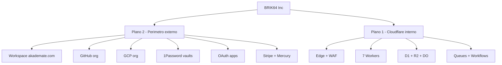

---

## 1. Edge y 7 unidades de despliegue

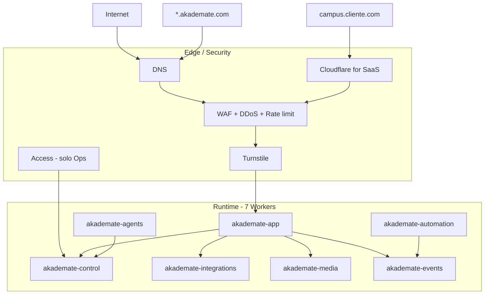

Los dominios Students / Teachers / Campus / Finance / CRM son **módulos de software**, no Workers extra.

---

## 2. Identidad y datos transaccionales

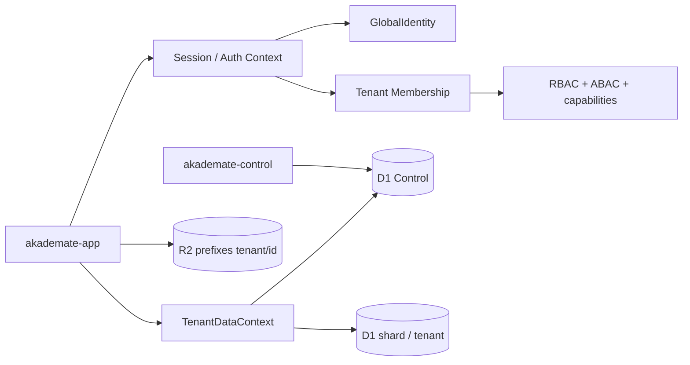

---

## 3. Resolución D1 (aislamiento)

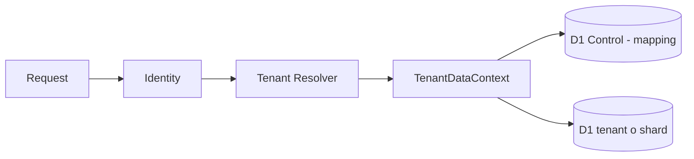

```text
1 x Control D1
+ shards D1  (V1: pool, no 50k bindings en un Worker)
+ 1 D1 por tenant  (objetivo de cuenta / provisioning API, no wrangler estático)
```

Tenant excepcional ~7-8 GB SQL: particionar `core / academic / finance / archive` **antes** de 10 GB.

---

## 4. Durable Objects (sin servidor WS central)

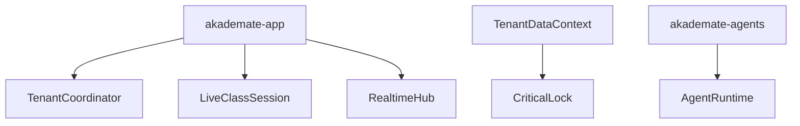

Escala: una instancia `TenantCoordinator:{tenantId}` por tenant. Sesiones y agentes son objetos efímeros. Soft limit ~1.000 req/s **por objeto**; se reparte entre IDs, no se agranda un objeto.

---

## 5. Colas, DLQ y Workflows

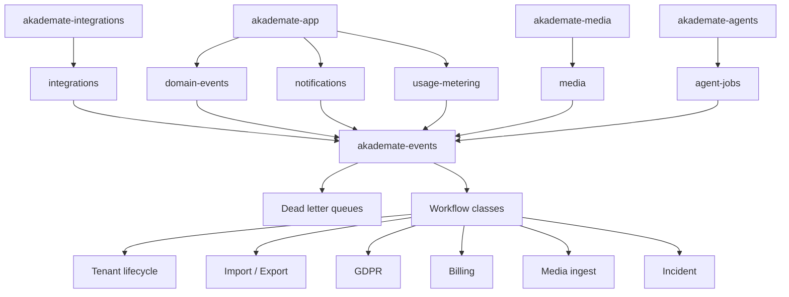

Colas **por función**, no por tenant. A ~10.000 tenants: shard `domain-events-0..3` con `hash(tenantId) % 4`. Local Miniflare no reproduce concurrency de consumers.

---

## 6. Vídeo (Stream) e IA

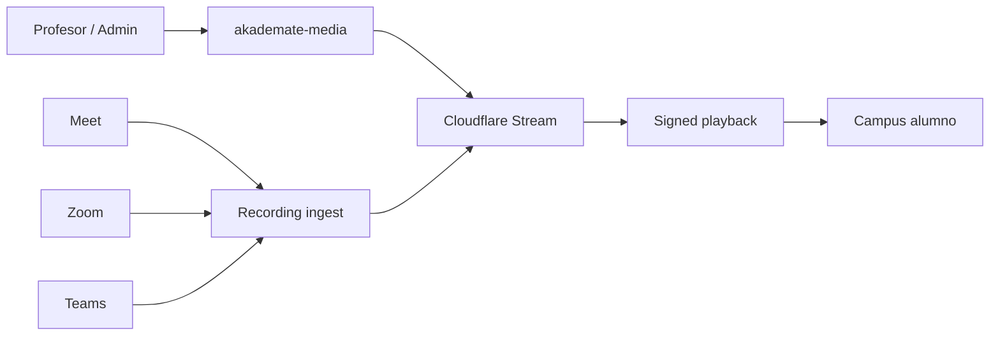

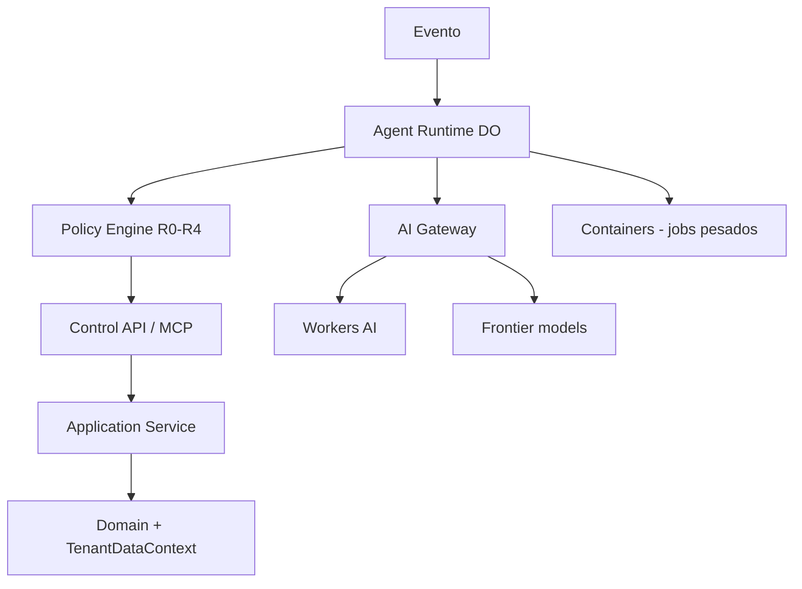

Nunca: Agent → D1 directo.

---

## 7. Observabilidad y secretos

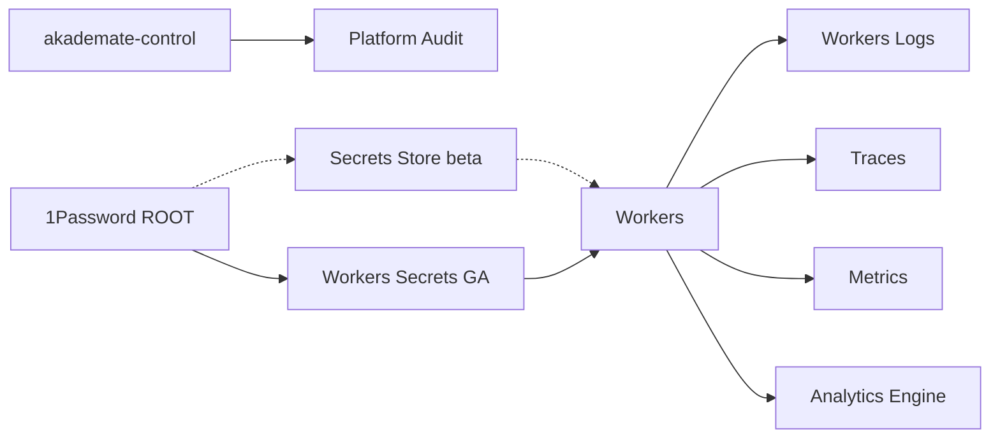

Datasets AE globales (no uno por tenant): `platform_usage`, `tenant_usage`, `platform_health`, `business_events`, `ai_usage`, `media_usage`.

---

## 8. Perímetro externo (cuentas)

```mermaid
flowchart TB
  LEGAL[BRIK64 Inc]
  LEGAL --> DOMAIN[akademate.com]
  LEGAL --> WS[Google Workspace]
  LEGAL --> PASS[1Password]
  LEGAL --> CF[CF Account AKADEMATE]
  LEGAL --> GH[GitHub akademate]
  LEGAL --> GCP[GCP Organization]
  LEGAL --> MS[Entra app]
  LEGAL --> ZOOM[Zoom app]
  LEGAL --> AI[AI provider projects]
  LEGAL --> STRIPE[Stripe BRIK64]
  STRIPE --> MERCURY[Mercury]

  WS --> ADMIN[admin@]
  WS --> BREAK[breakglass@]
  WS --> INFRA[infra@]
  WS --> SEC[security@]

  ADMIN --> CF
  ADMIN --> GCP
  ADMIN --> GH
  ADMIN --> PASS
  BREAK -.-> CF
  BREAK -.-> GCP
```

Una cuenta Cloudflare. Una org GitHub. Una org GCP. **Cero cuentas admin por tenant.**

---

## 9. OAuth de clientes (no nuestras cuentas)

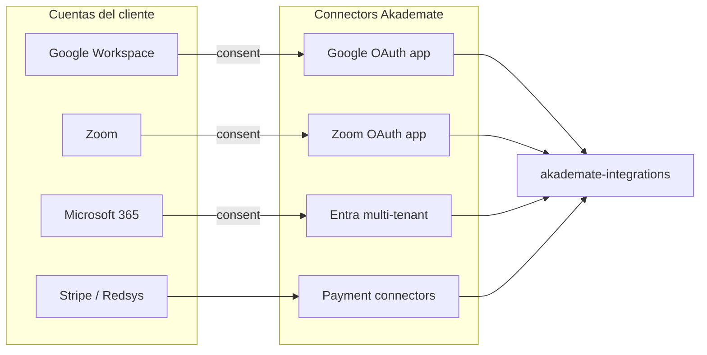

---

## 10. Dos logins (no mezclar)

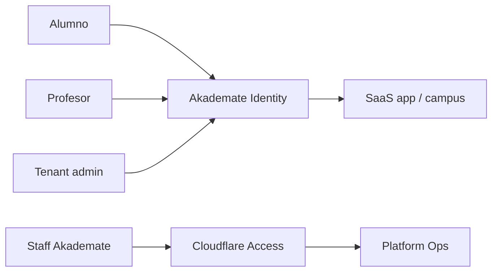

Access **no** autentica alumnos.

---

## 11. Billing de plataforma vs cobro del tenant

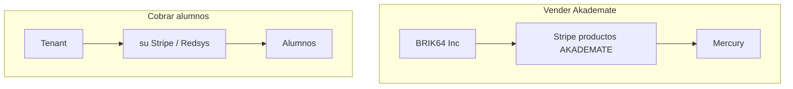

Nunca mezclar las dos cajas.

---

## 12. Dual runtime (Cloud vs On-Prem)

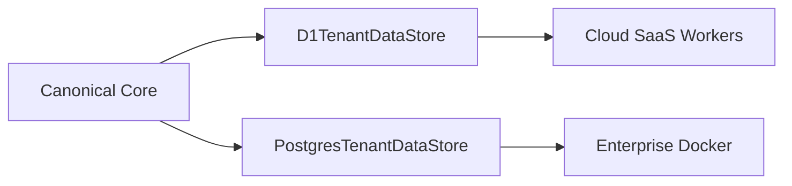

---

## 13. Mapa comprimido

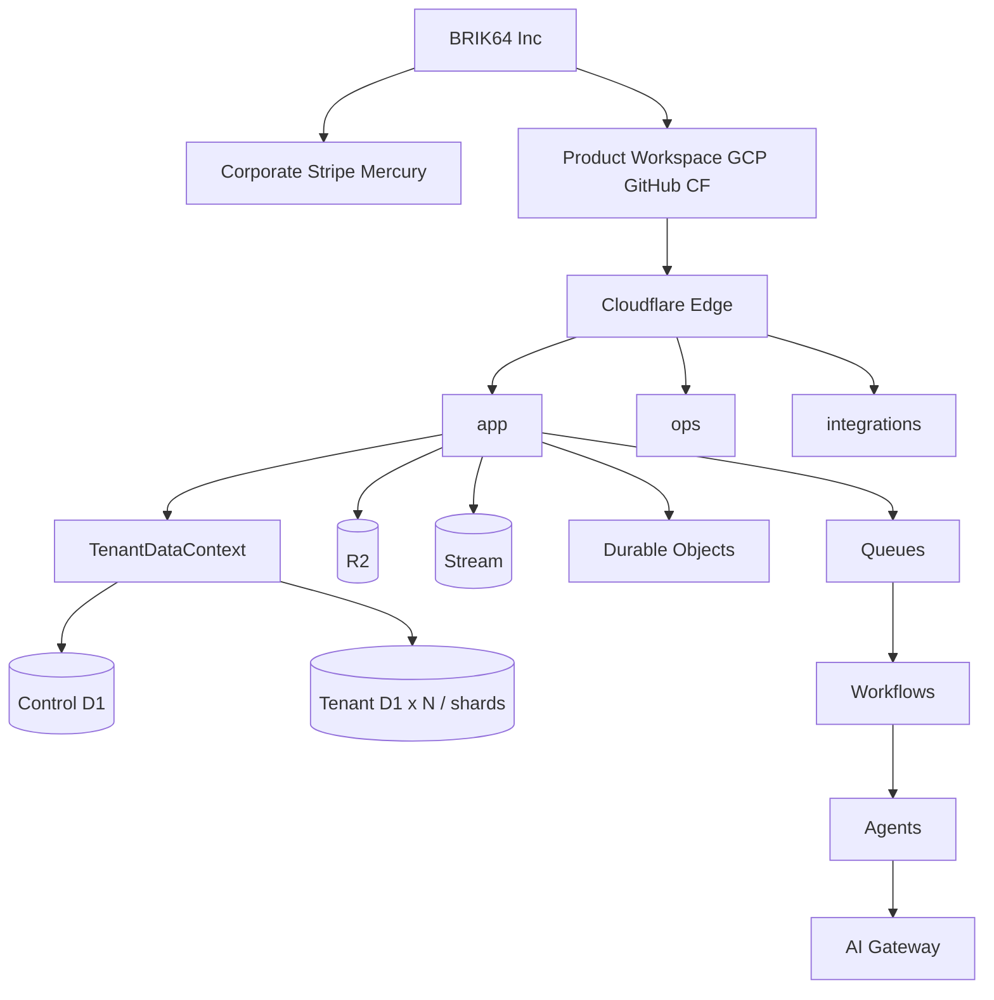

---

## Dual runtime request (secuencia)

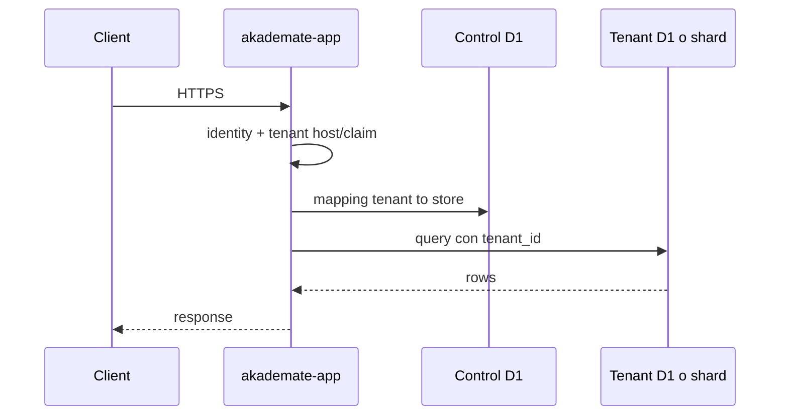

---

## AutonomousOps loop

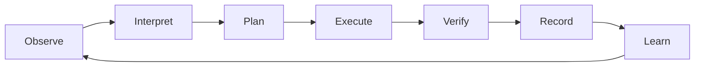

---

## Matriz de escala (misma arquitectura)

| Recurso | 10 | 100 | 1.000 | 10.000 |
| --- | ---: | ---: | ---: | ---: |
| Workers app | ~7 | ~7 | 7–9 | 8–12 |
| D1 Control | 1 | 1 | 1 | 1 |
| D1 tenant / shards | 10 / pool | 100 / pool | shards | shards + lift 1 TB |
| R2 buckets prod | 3–4 | 3–4 | 3–5 | 3–8 |
| Queues + DLQ | 6+6 | 6+6 | 6–10 | 12–24 shard |
| TenantCoordinator DO | ~10 | ~100 | ~1.000 | ~10.000 |
| Custom hostnames | 0–10 | ~100 | ~1.000 | ~10.000 |

Cambia volumen y shards, no el diseño. Vigilancia: **bindings por Worker**, **TB D1 agregado**, **msg/s por cola**.
