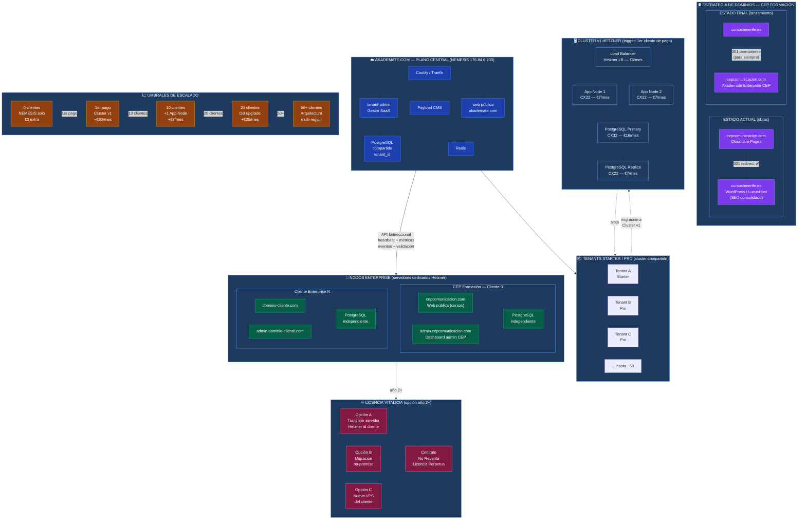

# Akademate — Diagrama de Arquitectura e Infraestructura

**Ver en Mermaid Live:** https://mermaid.ai/live/edit?utm_source=mermaid_mcp_server#pako:eNqVV91u40QUfpWjrBalqpu1nTTt9gLJcUwbkTgmTndZCIom9qQ169hm7HR_WFaAhMQF0iItQiAhISGBhMQN4gZxwU3fpC8Aj8CZ8U_sJtktuWg94_OdOX_zneOPa07o0tpRbe6Hj5xzwhIYdyYB4C9ezs4Yic6hOxz0zN7Qfn9S-_fHr74Gwx6PtLFx3NOgaxRv4erTb0A3LHhrOBpoeu_ypTmpfZCq4j_XY9RJvDCA_mi1WxxyMnyA-lG11h2Cpo9PtT7Uwxkj8U5FDf_hKVN9OEB5h0ZOuFgGnkMcVN3AxWQS6H64dOc-YRQsckZjVAB7e28-m9SasgKMpqbA1Q9fTGrPQB9zRUsWh3FCA8q8OW0gZhLcD5lrMRrHcAf6S2cZn6AE7tdtYwhOGMSh77nEDasG0sDd4N5bPVPrrxwUS6j7JHhKFh4NknCDl2N1o2EVZyLKFiRABZQbFhFGIPboImJ0R_iWRkrdGirtIXHpgiQUDNTBIubFlKM2uyQerlWHbphYDty3q-8---fPF6C9rXWNARZIA08WVWH1NXOYC0LdNAaG3bNBOWg3DluNdkNtyjtbaiUvRv7rd6YmHqOHGPf5E0zKmBE69x5WoJb2oD_UuihnkSd-SFzQB3ZFYmyYmjmeal2sWxTD0JIg2SPuwgswIMc0TkIGNiFV1H2jM7VOOwh4RGcQXf418zGSCCB5BEVEK6YcT-0TbWQIYzCHZ4za7_QRgoKYqcRzQ1yk5089t4JFVI9fuBEWa1x5w6PACyD3FN6oeITLzNS1mFyXFEpyG9el-Wthxvbcp9BpqjXlh5e_ZIfYgKU-GhsjTJQ1GkLd8ZdYxwxW3u_cgCDGCqodixiBhuGyE8RSVs2oupLpoIzFwur75uq9vuk9r4NGowHnJE4IPN-Xi9cbK75_aqNf03uK8Pjbn3nVZ5twocCJMX7PxMd6wryzM8qOQOFu-_yeU3ApROQsvEnBn_R5vfV5EXcIcoWDfk-CE5o8RTbAQhCX6-rz39p3FrRaJJplceO0KAIT-R0UzorvqmqOONiEUMsI9bWILlZZpbLBYt6CsCcC2SyQSnsTdFSFjmiU3adXH4ohEYXJHcR65lZXvc42hRC3sGpvvj3anl1kKWNkjXq2IbL74icwh11sb6t9qMeUXWD9Ym_AdLpotxvGkOXlJoktkac1RfX8KNE6Q2Rzx7v8I0i7aVYy8sYOiNd8K63fL3EU3jzRQzb30ZwGBf81Nmvrkvh8FhLmgpBa6w-5rm7nOtN5gUsjjLLwY5sXmLLCEpGgVNfrWiomhFdsHqRS_zLXTjLULFxuiA544V52G9c4OxOuRuWGoP_rfmoUep8fKJwXim7Yey2sSIOPSrz7fv8356F-D_usjqPZvd5YwwU-1cMorSly-XsI6u5NaHdoYZdArcMMyqkX220Qz3EOYZBfgBIdET-nuIp6rqhTUsT5eeCh-WKJizDYw2llgXlbw-klHOdtc0kvQrhn2fjs0s3n6UM-ZYiZTg-DhJGEN1kzRIa5QGHOMH3PoYHjEbCwYGiyJGsHa5gUYXj2X0_LMlP9in6oY8jN47QRfgmngw4OPIbNx2SDv8PR7waxt2VUIOfe8Uk0n5hw4uTeIDPKQB-jcxVtNqd83mp4fxFjcNpwLzj7P0fQobzGpza_QkrlsF0F8i7AVxtp2OYdVa3Auh1YRhiGAqXur8NaCNuXd8s4jX209BIMw5Lx5CyWfuLtMXqGUali5WzsLTzE-dZW8s2SLXxfzfbVa_vNbB-NEOvWWjJv3wYsHPoYz0d6R0LBUomIj_gg5ax0ik3VaFYPZp5II-dL4qMH5xQnlBklCezC4vJXHAIcwh0V9Yd9YhcuCP9wSC8AGrHqLGtHXJuw0vfVPdhrCFMWxaUCUk0-_w4oRpbsiGKdw4kffkhESDacWOp9qd8Zk3D5goNKATTixPPDLGKOT-K4S-eAtw5L1oe55_tHtxTakslcihMWPqRHt5qzQ3XelhyscHZ0az6fXwPTFb2neLm9P2-1C7wiz-4eKtvxyOEEW1eKPXCahLoFlhwczuZkOzZ2MGHBWQa-q7ZkmRbg-f5dKs-2g6OMZHK_D5vKYau5grcO1Nkr_M6n5jxoTbK_ClpbxlXV8BI8n-Sl8tQvZV8HUjH5S2LIl8R3RZaispKsSUtFi5bS9iyl7UvKm5ckGlcpT9eV4NegpI-l_JMUn9UsK2VJW5ZsRbJVyW5KdisPfVlCELQk6Fn81aWcmFexLsvjyCjxyZD_USU-BfI_ozyyk6D2yX8oIkiH

