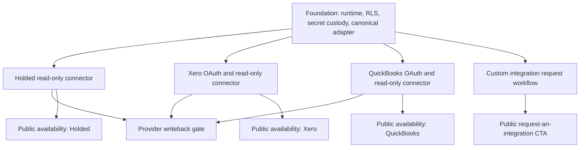

# Akademate Finance Integrations Program Implementation Plan

> **For agentic workers:** REQUIRED SUB-SKILL: Use superpowers:subagent-driven-development (recommended) or superpowers:executing-plans to implement this plan task-by-task. Steps use checkbox (`- [ ]`) syntax for tracking.

**Goal:** Build a tenant-safe financial integration plane for Akademate Next with native Holded, Xero, and QuickBooks Online connectors, a governed custom-integration request path, and claim-safe public communication.

**Architecture:** Akademate remains the authority for offers, enrolments, and its append-only payment-event ledger. A provider-neutral finance contract projects those facts into accounting connections and imports accounting facts back into a tenant-scoped read model. External I/O, webhooks, and writeback are separate capabilities and remain fail-closed until their own sandbox and release gates pass.

**Tech Stack:** Next.js 15 App Router, TypeScript 5.9 strict mode, Payload 3.81, PostgreSQL 16 with forced RLS, `postgres` transactions, Zod 4, Vitest/Node test runner, Playwright, BullMQ/Redis for asynchronous sync, AES-256-GCM envelope encryption behind a secret-store interface, Tailwind v4 and `@akademate/ui`.

## Global Constraints

- Work only in `/Users/carlosjperez/Documents/GitHub/akademate-next-offers-integrated` for the SaaS implementation.
- CEP Formación is read-only context; do not mutate, build, restart, deploy, query production data, or reuse its credentials.
- Every financial row carries `tenant_id`; every relationship uses a tenant-composite foreign key where the referenced entity is tenant-owned.
- Database access uses the non-owner, non-superuser, `NOBYPASSRLS` application role and forced RLS.
- `paid_offer_orders` and `paid_offer_payment_events` remain the payment and enrolment authority; accounting connectors consume their normalized projection.
- Browser redirects never prove payment, settlement, invoice creation, reconciliation, or provider authorization.
- Provider credentials are encrypted server-side, never returned by an API, never logged, and never stored in Git or browser storage.
- Runtime modes are exactly `disabled`, `scaffold`, and `connected`; missing or malformed configuration resolves to `disabled`.
- `scaffold` permits no provider network traffic, real-data sync, webhooks, or writeback.
- `connected` still requires separate booleans for external I/O, real data, webhooks, and writeback.
- Initial connectors are read-only. Writeback is a separate release with preview, explicit approval, idempotency, and audit.
- Public pages may label a connector `available` only after the matching sandbox, staging, deployment, and served-artifact gates pass.
- No official provider logo is added without using the provider's permitted brand asset and retaining an asset-source record.
- No provider fees, accounting correctness, tax filing, or certification outcome is implied by the integration.
- Local implementation, commit, push, deployment, provider activation, and live verification are separate decisions.

---

## Solution Registry

| Approach | Core idea | Correctness | Maintainability | Scalability | Simplicity | Pragmatism |
| --- | --- | ---: | ---: | ---: | ---: | ---: |
| A. Native adapters on one canonical finance contract | Implement provider-specific semantics behind one tenant-safe contract | 9 | 9 | 9 | 6 | 9 |
| B. Aggregator or iPaaS as the primary financial authority | Delegate normalization and provider access to one third party | 6 | 6 | 7 | 8 | 7 |

**Selected:** Approach A. It preserves provider semantics, auditability, tenant isolation, and product control. An aggregator may be introduced only as a secondary adapter for low-demand providers and must still emit the canonical Akademate finance contract.

## Program Authority and Source Boundaries

| Fact | System of record | Connector treatment |
| --- | --- | --- |
| Course, event, cohort, offer | Akademate | Export reference only |
| Enrolment and learner status | Akademate | Export reference only |
| Stripe/PayPal/SEPA payment event | Akademate normalized payment ledger | Project into finance export queue |
| Provider checkout redirect | No financial authority | Ignore as settlement evidence |
| Chart of accounts | Accounting provider | Import and map |
| Provider invoice identifier/status | Accounting provider after accepted writeback | Import and reconcile |
| Tax codes and reporting | Accounting provider/user configuration | Import; never infer filing correctness |
| Expense and supplier records | Accounting provider | Import read model |
| Bank reconciliation status | Accounting provider | Import read model |

## Dependency Graph

## Plan Set

1. [Finance connector foundation](./2026-08-10-finance-connector-foundation.md)
2. [Holded native accounting connector](./2026-08-10-holded-native-accounting-connector.md)
3. [Xero native accounting connector](./2026-08-10-xero-native-accounting-connector.md)
4. [QuickBooks Online native accounting connector](./2026-08-10-quickbooks-native-accounting-connector.md)
5. [Custom integrations and public surface](./2026-08-10-custom-finance-integrations-public-surface.md)

## Native Expansion Queue

Holded, Xero, and QuickBooks Online are the first native connectors. Sage Business Cloud Accounting, Zoho Books, A3, Exact Online, and country-specific systems enter discovery through the custom-integration workflow. A provider graduates to a native connector when at least one contracted Enterprise requirement or three qualified tenant requests justify the maintenance cost, the provider exposes a supported API and test environment, and a provider-specific implementation plan passes the same auth, RLS, idempotency, sandbox, deployment, and public-claim gates.

Until graduation, those providers are `custom-request`, not `available` or `coming-soon`, and their logos do not appear in the native connector row.

## Release Gates

### Gate 0: Plan and authority

- [ ] Record exact source SHA and clean worktree.
- [ ] Confirm `AKADEMATE_RUNTIME=next` migration selection.
- [ ] Confirm no CEP path, hostname, credential name, or deployment identifier appears in the planned diff.
- [ ] Approve ADR and provider-neutral interfaces.

### Gate 1: Foundation local

- [ ] Runtime resolver passes malformed/missing flag tests.
- [ ] Migration applies and rolls back on fresh PostgreSQL 16.
- [ ] All finance tables have enabled and forced RLS.
- [ ] App role is non-owner, non-superuser, and `NOBYPASSRLS`.
- [ ] Cross-tenant reads/writes and composite-FK substitutions fail.
- [ ] `scaffold` produces zero provider requests.
- [ ] Credential API never returns plaintext, ciphertext, nonce, tag, or key version.

### Gate 2: Provider sandbox

- [ ] Provider credentials belong to a dedicated sandbox/demo organization.
- [ ] Read-only scope is the minimum needed for the connector milestone.
- [ ] Initial import is idempotent.
- [ ] Cursor replay is idempotent.
- [ ] Duplicate and out-of-order webhook or polling results do not duplicate finance facts.
- [ ] Token/API-key revocation moves the connection to `degraded` or `revoked` without deleting evidence.
- [ ] Rate limiting uses provider-specific backoff and preserves the last successful checkpoint.

### Gate 3: Isolated staging

- [ ] Deploy exact reviewed SHA with finance mode `scaffold` and all provider flags false.
- [ ] Apply migration with owner role; run app with app role.
- [ ] Inject sandbox credentials from the authorized secret channel.
- [ ] Activate one synthetic tenant and one synthetic finance entity.
- [ ] Reconcile imported objects against the provider UI and exported payment facts against the Akademate ledger.
- [ ] Capture desktop/mobile UI, console, network, logs, and database evidence without secrets or personal data.
- [ ] Execute disable/revoke/rollback drill.

### Gate 4: Native availability

- [ ] Activate provider for a bounded pilot tenant under explicit authorization.
- [ ] Verify scheduled sync, provider-side revocation, and error recovery.
- [ ] Verify deployed SHA and served artifact.
- [ ] Change public connector status from `coming-soon` to `available` in a separate public-web commit.
- [ ] Keep provider transaction/subscription charges and bespoke mapping work described as separate costs.

### Gate 5: Writeback

- [ ] Define supported outbound document types per provider.
- [ ] Generate a human-readable preview before submission.
- [ ] Require a finance-authorized user and explicit confirmation.
- [ ] Use a canonical idempotency key and immutable audit event.
- [ ] Reconcile provider response before marking the operation complete.
- [ ] Route mismatches to `requires_review`; never retry semantic failures blindly.
- [ ] Run sandbox create/replay/reject/timeout/partial-failure/rollback cases.

## Program Checklist

- [ ] Foundation ADR, schema, runtime, secret store, APIs, UI, tests, and runbook.
- [ ] Holded read-only connector and sandbox proof.
- [ ] Xero OAuth/read-only connector and sandbox proof.
- [ ] QuickBooks OAuth/read-only connector and sandbox proof.
- [ ] Custom integration request workflow and internal triage states.
- [ ] Claim-safe connector catalogue on Home, Features, and Pricing.
- [ ] Writeback scope approved per provider.
- [ ] Broad local suite and UI audit.
- [ ] Commit and push each independently reviewable milestone.
- [ ] No deploy until a separate deployment authorization identifies target SHA and environment.

## Progress Accounting

Use these percentages for the finance-integration program, not for the entire Akademate product:

| Dimension | Definition | Current baseline |
| --- | --- | ---: |
| Audited | Repo/provider/authority analysis complete | 100% |
| Planned | Every in-scope requirement mapped to a task and gate | 100% after this plan set passes self-review |
| Implemented | Code, migration, UI, and provider adapters merged | 0% |
| Tested | New unit, database, sandbox, and visual tests passed | 0% |
| Committed | Implementation commits created | 0% |
| Pushed | Implementation commits present on remote | 0% |
| Deployed | Exact implementation SHA deployed to Akademate Next | 0% |
| Live verified | Served artifact and provider behavior independently checked | 0% |

## Execution Order

- [ ] Execute the foundation plan first.
- [ ] Execute Holded after Gate 1.
- [ ] Execute Xero and QuickBooks after Gate 1; these can run in isolated worktrees in parallel.
- [ ] Execute custom-request workflow after the foundation schema exists.
- [ ] Update public copy in the public-web worktree only after deployment ownership is re-verified.
- [ ] Execute writeback only after read-only production evidence is reviewed and separately authorized.
